# Prise en main de Modélio : Diagrammes de classes


[Les diagrammes de classes présentent la structure interne des éléments et leur relations aux autre éléments.](https://forge.modelio.org/projects/modelio-user-manual-french-22/wiki/Modeler-_modeler_diagrams_creating_diagram)


Besoin d'un petit rappel sur les diagrammes d'états ? [ici](http://agilemodeling.com/artifacts/classDiagram.htm) et [là](http://agilemodeling.com/style/classDiagram.htm)

Nous considérons qu'arrivé(e) à ce point du tutoriel, vous avez réalisé les parties précédentes relative à la prise en main des [diagrammes de cas d'utilisation](Modelio_UseCase.md) et des [diagrammes d'activités](Modelio_Activites.md) et que vous savez désormais comment redimensionner un élément, le renommer, changer son apparence, le supprimer, l'annoter,...

Dans ce tutoriel, nous nous verrons comment :

* [Créer un diagramme de classes](#creerDiagrammeClasses)
* [Créer une classe](#creerClasse)
* [Ajouter un attribut à une classe](#ajouterAttribut)
* [Ajouter une opération à une classe](#ajouterOperation)
* [Créer une association](#creerAssociation)
* [Créer une association réflexive](#creerAssociationReflexive)
* [Créer un qualifieur](#creerQualifieur)
* [Affiner une association en agrégation ou en composition](#affinerAgregationComposition)
* [Connaître les raccourcis autour du diagramme de classes](#raccourcisDiagrammeClasses)


Vous aurez quelques exercices à réaliser tout au long du tutoriel :

* [Commencer par identifier les premières classes](#aVosCrayons_Exo1)
* [Réaliser une première ébauche du diagramme de classes](#aVosCrayons_Exo2)
* [Réaliser une deuxième ébauche du diagramme de classes](#aVosCrayons_Exo3)

Nous finirons par :

* [Recenser les différents éléments spécifiques aux diagramme de classes](#elements_DiagClasses)
* [Des exemples de diagrammes de classes réalisables avec Modelio](#exemplesDiagClasses)
* [Quelques mots sur les diagramme de classes dans la démarche d'analyse du cours](#analyseUML_DiagClasses)


N'oubliez pas que vous pouvez, à tout moment, revenir consulter le [Zoom sur le manuel utilisateur](Modelio_UseCase.md#zoomManuelUtilisateurs) (récapitulatif de liens vers les différentes parties du manuel utilisateur utiles pour la création des diagrammes).


## Créer un diagramme de classes <a id="creerDiagrammeClasses"></a>

Dans cette partie du tutoriel, nous allons réalisé le **diagramme de classes persistantes** de l'application **bookinons** que nous stockerons directement dans le package **`Vue logique`** de la vue **Model**.

La création d'un diagramme de classes se fait de la [même manière que les diagrammes précédents](Modelio_UseCase.md#creerDiagrammeUC).  

Rendez-vous sur le package **`Vue logique`** de la vue **Model**, puis choisir à l'aide d'un clic droit **`Créer un diagramme ou une matrice…` dans le menu contextuel.  
Sélectionnez le type de diagramme **`Class diagram`**
Renommez-le, par exemple en **`CD_Bookinons`**.  
Cliquez sur **OK** pour valider la création du diagramme.
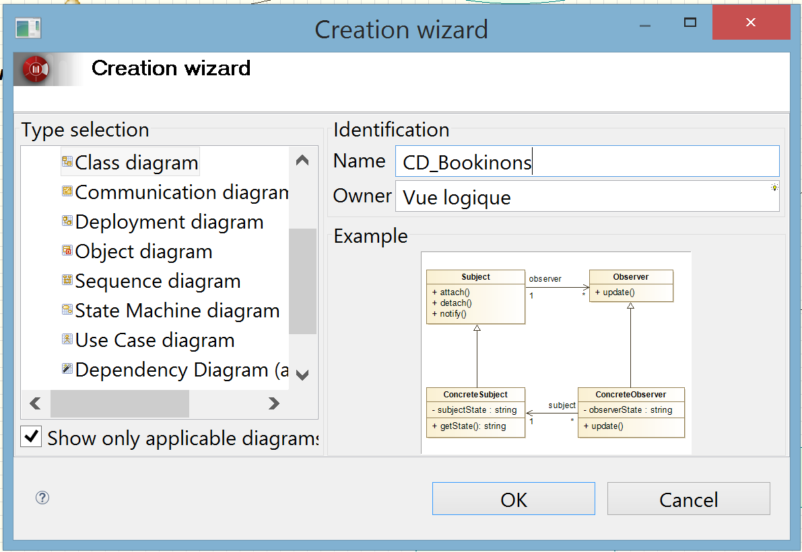

La **vue Modèle** est alors mise à jour avec le nom de notre nouveau diagramme : **`CD_Bookinons`** dans la vue logique en dessous du package **`UC Rechercher un Ouvrage`**. 


En vue de la préparation de la phase d'implémentation, dans le cadre de notre démarche, et afin de travailler de manière organisée, les classes ne seront pas déposées telles quelles dans le package **`Vue logique`**, mais elles seront réparties dans trois packetages que nous appelerons : **`presentation`**, **`metier`**, **`application`** afin de respecter le découpage en couches logicielles (MVC). 

Créer donc dans la **Vue logique**, les trois packages **`presentation`**, **`metier`**, **`application`**.  
Pour plus de faciliter pour la suite, faîtes remonter à l'aide des flèches jaunes les packages créés comme premiers paquetage dans votre **Vue logique** afin d'obtenir une arborescence simialire à la suivante :

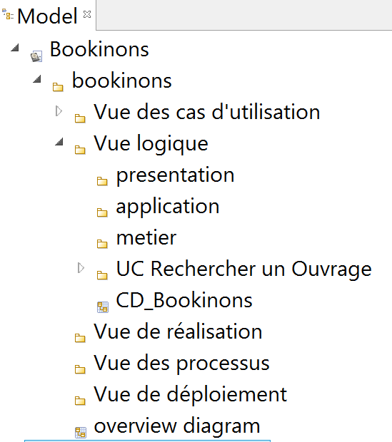


**N'oubliez pas de sauvegarder régulièrement votre projet au cours de ce tutoriel...**


## Créer une classe <a id="creerClasse"></a>

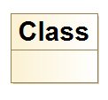
  
Une **classe** (**`Class`**) est un ***élément de type *noeud***.    
Dans Modelio, l'élément **`Class`** est associé au groupe **`Class Model`** de la palette graphique. 


#### Nouvelle classe
Pour ajouter une nouvelle **classe**, sélectionnez **`Class`** du groupe **`Class Model`** de la palette graphique, puis cliquez sur sur votre **diagramme de classes** à l'endroit souhaité pour faire apparaître l'action.

La première classe que nous souhaitons créer est la classe **`Livre`**.
C'est une classe **`metier`**, persistante, également appelées **entités** (ou *Entity*).
Placez-vous dans le package **`metier`** de la **Vue logique**.

Renommez la classe en **`Livre`** (en utilisant **`F2`** par exemple)
Puis rendez-vous dans la **vue logique** pour déplacer cette classe dans le package **`metier`**.


## Ajouter un attribut à une classe <a id="ajouterAttribut"></a>

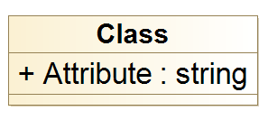

Sous Modelio, un **attribut** (**`Attribute`**) est associé au groupe **`Class Model`** de la palette graphique. 

#### Nouvel attribut
Pour créer un nouvel attribut, il est possible d'utiliser la palette graphique et de faire un glisser-déposer de l'icône **`Attribute`** dans le diagramme sur la classe concernée.
L'attribut apparaît alors dans la classe et il suffit de le renommer (**`F2`**) en **`isbn`** par exemple.
**Remarque:** par défaut le type de l'attribut est **`string`** et est apparaît, nous verrons comment paramétrer les propriétés de l'attribut par la suite.

Pour créer un nouvel **A**ttribute, il est également possible d'utiliser le raccourci de création **`A`**.
Cliquez sur la classe **`Livre`** pour la sélectionner, appuyez sur **`A`**, puis cliquez à l'intérieur de la classe **`Livre`** pour y faire apparaître un nouvel attribut. Il ne vous reste plus qu'à renommer ce dernier en **`string`** par exemple.

Ajoutez trois nouveaux attributs : **`langue`** **`dateParution`** et **`dateParution`** de manière à obtenir une classe similaire à la classe ci-après.

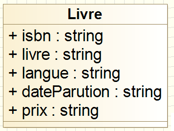

**Rappel:** Vous pouvez redimensionner automatiquement la taille de votre classe grâce à utiliser l'icône .

#### Propriétés d'un attribut

Comme tout autre élément, un **`Attribute`** possède une **vue Element** et une **vue Symbol**.
Les propriétés d'un attribut vont pouvoir être modifiées au travers de la **vue Element**.

##### Visibilité
Par défaut, le **niveau de visibilité** est public **`+`**.
Nous allons modifier le niveau de visibilité de tous les attributs afin de les rendre tous  privés **`-`**

Placez-vous sur le premier attribut **`isbn`**. Rendez-vous dans sa **vue Element**.
Changez la valeur de la propriété **`Visibility`** de **`Public`** vers **`Private`**.

Faites-en de même avec les 3 autre attributs.

##### Type
Par défaut, le **type** est **`string`**.

Placez-vous sur le premier attribut **`dateParution`**. Rendez-vous dans sa **vue Element**.
Placez-vous sur la valeur de la propriété **`Type`**.
Ecrivez **`date`**  à la place de **`string`**.  
Vous pouvez alors utiliser l'auto-completion c-a-d faire un **`CTRL+ESPACE`**. Modelio vous propose de choisir le type *date* qu'il connait **`date(from 'UML Type')`**, double cliquez dessus pour l'affecter comme nouvelle valeur de la propriété **`Type`**.

Modifiez de même la propriété **`Type`** de l'attribut **`string`** en transformant le **`string`** en **`float`**.

Votre classe **`Livre`** est désormais similaire à la classe suivante :  

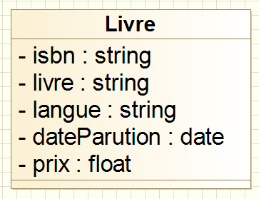

## Ajouter une opération à une classe <a id="ajouterOperation"></a>

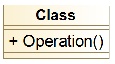

Sous Modelio, une **opération** (**`Operation`**) est associé au groupe **`Class Model`** de la palette graphique. 

Pour créer un nouvelle nouvelle opération dans une classe, on procède de la même manière que pour créer un nouvel attribut :

* soit ***à partir de la palette graphique*** et d'un glisser-déposer de l'icône **`Operation`** dans le diagramme sur la classe concernée.
* soit ***directement sur le diagramme*** à partir du raccourci de création **`O`**, une fois la classe sélectionnée.
* soit ***à partir de la vue Model*** en se plaçant sur la classe concerné, puis en ouvrant  d'un clic droit le menu contextuel pour choisir (`Create element -> Operation`)

Pour le moment, nous ne souhaitons pas créer d'opérations dans nos classes.


## Exercice : Commencer par identifier les premières classes <a id="aVosCrayons_Exo1"></a>

Afin de mettre en pratique tout ce qui prècède, créez deux autres classes **`Editeur`** et **`Auteur`** sur votre diagramme de classes. Ces classes devront se trouver dans le paquetage **`metier`** et votre diagramme de classes doit être conforme au diagramme ci-après :

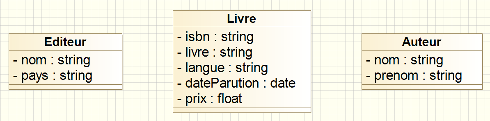

**Remarque:** 

* Il est possible de créer une classe à partir de la **vue Model**.  
Par exemple, placez-vous sur le package **`metier`**, puis d'un clic droit sélectionnez (`Create element -> Class`). Renommez cette classe en **`Editeur`**. Il ne vous reste plus qu'à la glisser-déposer sur votre diagramme pour qu'elle apparaisse au côté de la classe **`Livre`** déjà présente.

* De la même manière, il est possible de créer un attribut directement à partir de la **vue Model**.  Pour cela, il suffit de se placer sur la classe concernée par ce nouvel attribut, puis d'un clic doit, sélectionner (`Create element -> Attribute`).

## Créer une association <a id="creerAssociation"></a>

Sous Modelio, une **association** (**`Association`**) est associé au groupe **`Class Model`** de la palette graphique. 

***Un Livre est edité par un Editeur.***    
Pour modéliser cette phrase, nous devons donc créer une nouvelle association entre la classe **`Livre`** et la classe**`Editeur`**.  

#### Nouvelle association

Pour créer une nouvelle association, il est possible d'utiliser la palette graphique.
Sléectionnez l'icône **`Attribute`** dans le diagramme sur la classe concernée.

Cliquez sur la classe origine de l'association :**`Livre`**.
Cliquez sur la classe destination de  l'association : **`Editeur`**.

**Remarque:** Un raccourci clavier est également disponible pour créer plus rapidement une association. Il s'agit de **`ESPACE`**.

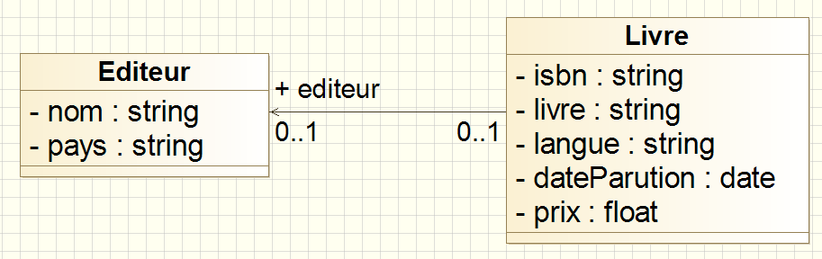

Comme l'indique la figure ci-dessous, par défaut :

* une ***assocication navigable*** est alors créée entre les deux classes.
* le **rôle de la classe destination** apparaît et possède le même nom que la classe **`+editeur`**.
* une **multiplicité de `0..1`** est attribuée par défaut à chaque classe.

Il est donc maintenant nécessaire de paramétrer cette association en fonction de nos besoins.
Comme chaque élément de diagramme sous Modélio, l'**`Association`** possède une **vue Element** qui va nous permettre de retrouver toutes les propriétés liées à l'**`Association`**.


#### Multiplicité d'une association

***La multiplicité indique le nombre d'instances qui participent à l'association.***

##### côté **`Editeur`**
Nous savons qu'***un** livre est edité par **un** éditeur*  
Il n'y aura donc qu'une seule instance d'**`Editeur`** par instance de **`Livre`**, c-a-d que la multiplicité du côté de la classe **`Editeur`** doit être positioné à **`1`**.

Deux solutions sont donc envisageables pour modifier une multiplicité  : 
 
* soit agir directement depuis le diagramme
* soit agir depuis la **vue Element** de  l'**`Association`**


Pour modifier la multiplicité côté **`Editeur`** , nous allons directement agir sur le diagramme. Placez vous sur la multpilicité, puis renommez la (**`F2`**) en **`1`**.

**Remarque :** Vous pouvez ensuite vous rendre dans la **vue Element** pour constater que votre modification a bien été prise en compte. En effet, dans la colonne **`Editeur`**, la valeur de la propriété **`Multiplicity min`** est désormais à  **`1`**, ainsi que la valeur de la propriété **`Multiplicity max`**.

##### côté **`Livre`**

Nous savons qu'***1** éditeur peut éditer par **1 ou plusieurs** livres.*  
La multiplicité côté **`Livre`** doit donc être apparaître comme une multiplicité `1..*`.

Pour modifier la multiplicité côté **`Livre`** , nous allons cette fois-ci utiliser **vue Element** de l'**`Association`**.   
Rendez-vous dans cette vue pour modifier les valeurs des propriétés de la colonne **`Livre`** de la mamière suivante :  

* Choisir la valeur **`1`** pour la propriété **`Multiplicity min`**
* Choisir la veleur **`*`** pour la propriété **`Multiplicity max`**

**Remarque:** Les valeurs des propriétés peuvent être tapées directement.
On vous conseille tout de même de les choisir à partir de la liste déroulante (flèche) qui limite les choix en veillant à éviter toute incohérence. En effet, une fois que la **`Multiplicity min`** est fixé à **`1`**, ne serait-il pas incohérent de pouvoir saisir une **`Multiplicity max`** à **`0`** ?


#### Rôle 

Le rôle est une propriété de l'association. 
Il est donc possible d'assigner ou non une valeur à la propriété **`Role`** de la **vue Element** de  l'**`Association`**.    

Est-il vraiment nécessaire que le rôle **`editeur`** apparaisse sur le diagramme ?
Si vous pensez que non, vous pouvez supprimer sa veleur, soit directement à partir du diagramme (**`F2`** puis **`SUPPR`**), soit à partir de la **vue Element**.
**Remarque:** Le rôle sera utilisé notamment lors de la génération de code.

Le nom d'un rôle peut, de la même manière être modifié.

#### Navigabilité

La navigabilité est représentée par une flèche l'extrémité de l'association.

La présence d'une flèche à l'extremité d'une assocation signifie qu'une instance de la classe pointée par la flèche est accessible par une instance de l'autre classe, d'où l'importance du rôle qui permettra de manipuler cette instance.

Si on laisse le rôle **`editeur`** sur l'association, au niveau de la génération de code, le fait que la classe **`Livre`** puisse accèder à une instance de la classe **`Editeur`** se traduira de la manière suivante (le rôle devient alors le nom de l'attribut lors de la génération de code) :
``` 
public class Livre
{
Editeur editeur;
...
} 
```

Pour montrer ou non la navigabilité vers une classe, il suffit de cocher ou décocher la propriété **`Navigable`** propre à chaque classe de l'**`Association`** et disponible également dans la **vue Element**.

**Remarque:** Il est important de bien prendre le temps de s'interroger sur la naviguabilité et le nom de rôle lorsque l'on souhaite aller jusqu'à la génération de code.  

Nous avons choisi, dans un premier temps, de ne pas représenter la navigabilité et les rôles dans les premières itérations (réflexions) sur notre diagramme de classes, nous ne les représenterons par la suite.


#### Nom d'une association

Il est possible de nommer une association en renseignant la propriété **`Association Name`** de la **vue Element**.
Vous pouvez par exemple choisir comme nom **`<est edité par`**.

**Conseil:** Attention à ne pas alourdir le diagramme avec trop de notation, comme par exemple indiquer à la fois le nom de l'association et le(s) rôle(s) sur une même association : c'est redondant !  
Dans une premier temps, vous pouvez nommer une association.
Puis, si vous voulez pousser votre réflexion, vous préférez surement faire apparaître sur votre diagramme la navigabilité et le(s) rôle(s) à la place du simple nom de l'association.

#### Un peu de pratique

Créez une nouvelle association créer la classe **`Livre`** et la classe**`Auteur`** et jouez sur les différentes propriétés des associations pour obtenir un diagramme de classes similaire au diagramme suivant :  

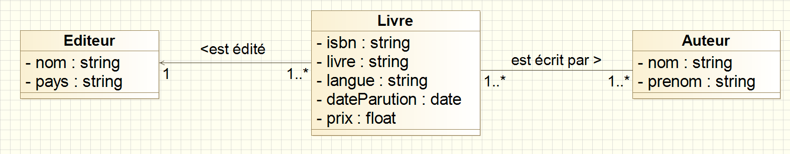


## Créer une association réflexive <a id="creerAssociationReflexive"></a>

Une association réflexive est une association qui permet de relier une classe à elle-même.

Pour illustrer la réflexivité nous allons modéliser la phrase suivante : *Il faudrait qu'un thème puisse si nécessaire être décomposé en un ou plusieurs sous-thèmes*.

Créez une classe **`Theme`** et une association réflexive sur cette classe.
Dans une association réflexive, l'indication du rôle est essentiel à la clarté du diagramme.
Modifiez le rôle, les multiplicités et donnez un nom à votre association afin que la modélisation proposée soit le plus explicite possible.

Vous devriez obtenir une modélisation similaire à la modélisation ci-dessous :

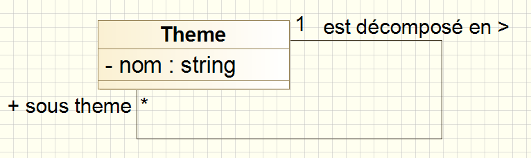

## Exercice : Réaliser une première ébauche du diagramme de classes <a id="aVosCrayons_Exo2"></a>

Après avoir rajouté dans le package **`metier`**, une nouvelle classe **`Catalogue`**, entraînez-vous à manipuler les éléments du diagramme de classes vus précédemment afin d'obtenir un diagramme de classes conforme à la représentation suivante :

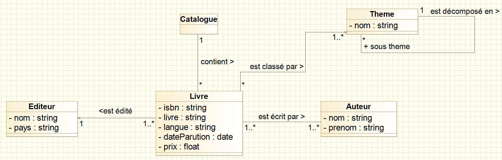


## Créer un qualifieur <a id="creerQualifieur"></a> 

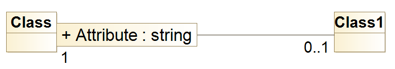  

Un qualificateur est **un attribut** de l'association.  
Il apparaît dans une boîte rectangulaire à l'**extrémité dune association**. 

Un qualificateur va permettre de sélectionner un sous-ensemble d'objets parmi l'ensemble des objets participant à l'association.  
Faire apparaître un qualificateur dans notre modélisation signifie donc qu'il est aussi nécessaire de **réduire la multiplicité** indiquée. 


Dans notre diagramme de classes, dans le contexte du **`Catalogue`**, un **`isbn`** est attribué à **1 seul `Livre`(ou à aucun)**.  
Il semble donc opportun de faire apparaître un **qualificateur `isbn`** pour affiner l'association entre **`Catalogue`** et **`Livre`**.


#### Nouveau qualifieur

Sous Modelio, la création d'un nouveau qualificateur (*qualifier*) se fait depuis la **vue Model.**  
Il suffit alors de se placer sur l'extrémité de l'association (**`association end`**) sur laquelle on souhaite faire apparaître un qualifieur, puis à partir d'un clic droit de choisir (`Create element-> Qualifier`).
Le qualifieur apparaît alors sur le diagramme de classes.

Pour que l'**`isbn`** apparaisse comme qualifieur auprès de la classe **`Catalogue`**, placez-vous dans la **vue Modele**, dépliez l'arborescence sous la classe **`Catalogue`** et placez-vous sur l'association (ou plutôt l'**`association end`**) qui existe (normalement, il n'y en a qu'une seule, puisque pour l'instant une seule association est reliée à la classe **`Catalogue`**).

Après un clic droit, suivi de (`Create element-> Qualifier`), renommez le qualifieur en **`isbn`**.

Vérifiez que votre qualifieur **`isbn`** est bien apparu sur le diagramme de classes.

**Remarque:** Le qualifieur, comme tout élément, possède une **vue Element** pour modifier ses propriétés.
Transformer par exemple la propriété **`Visibility`** de **`Public`** en **`Private`** ...

#### Transformation d'un attribut en qualifieur : impacts sur le diagramme

##### supprimer la redondance
L'attribut **`isbn`** est pour l'instant redondant sur notre diagramme de classes. Il apparaît à la fois en tant que simple attribut de la classe et en tant que qualifieur. Comme nous avons choisi de le transformer en qualifieur, il est donc maintenant nécessaire de supprimer l'attribut **`isbn`** dans la classe pour ne garder que le qualifieur **`isbn`**.

##### modifier les multiplicités
Le qualificateur permet de réduire la multiplicité.  
Si on se place dans le contexte du **`Catalogue`**, un **`isbn`** peut être attribué à 1 **`Livre`** ou à aucun : **`0..1`**.

Vous devez donc changer la multiplicité du côté de la classe **`Livre`** et transformer le **`0..`** en **`0..1`**

Une fois toutes ces transformations effectuées, votre diagramme de classes devrait ressembler au diagramme suivant :

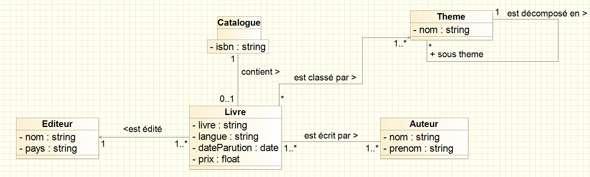  


## Affiner une association en agrégation ou en composition <a id="affinerAgregationComposition"></a> 

Il est également possible d'affiner le diagramme de classes en faisant apparaître des **agrégations** et des **compositions** qui sont des cas particuliers d'association qui exprime une relation de contenance plus ou moins forte.

#### Transformer une association en composition

Nous avons décidé de transformer l'**association** entre **`Catalogue`** et **`Livre`** en une ***composition*** puisqu'habituellement :   
***Un** catalogue *est composé* **de un ou plusieurs** livres*.  
La composition devra donc être modélisée **du côté de la classe `Catalogue`**.

Sur le diagramme de classes, placez-vous sur l'association entre **`Catalogue`** et **`Livre`**, rendez-vous dans la **vue Element** et modifiez la propriété **`Association Type`** de la colonne **`Livre`**, de manière à faire apparaître le symbole de la composition  du côté opposé c-a-d sur la classe **`Catalogue`**.

Le symbole de  composition  signifie "*est composée de*" : le nom de l'association entre **`Catalogue`** et **`Livre`** est maintenant explicite et superflu du fait de la présence de la notation graphique de la composition sur le diagramme. Supprimez donc le "*contient>*" de votre diagramme afin d'en alléger les notations pour en faciliter sa lisibilité.

Votre diagramme doit maintenant être similaire au diagramme ci-dessous

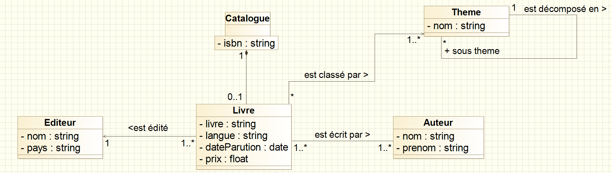  

#### Transformer une association en agrégation

De la même manière, vous pouvez transformer une *association* en **agrégation**.  
Pour vous entraîner, faîtes apparaître une **agrégation** entre la classe **`Theme`** et la classe **`Livre`** afin de modéliser le fait qu'un **`Theme`** contient des **`Livre`**s


#### Créer directement une agrégation ou une composition

Il est intéressant de remarquer qu'il est également directemment possible de créer sur le diagramme une agrégation ou une composition entre deux classes en utilisant les icônes correspondantes disponibles dans la palatte graphique.


## Exercice : Réalisser une deuxième ébauche du diagramme de classes <a id="aVosCrayons_Exo3"></a>

Rajoutez une composition sur la réflexive autour de la classe **`Theme`**.
En effet un thème peut être décomposé en sous-thèmes.

Une fois toutes ces modifications effectuées, votre diagramme de classes doit être similaire au diagramme suivant :

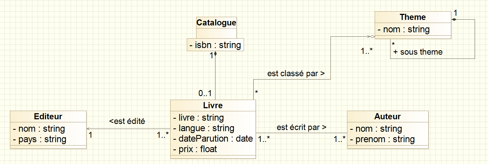

**Astuce:** Pour réorganiser l'ordre des attributs dans une classe, il faut, pour l'instant, utiliser l'astuce suivante. Créez une nouvelle classe temporaire sur votre diagramme. Déplacez tous les attributs dans cette nouvelle classe, puis redéplacez les attributs dans l'ordre souhaité dans leur nouvelle classe.

**Remarque:** Toutes les classes devraient se trouver dans le package **`metier`** :
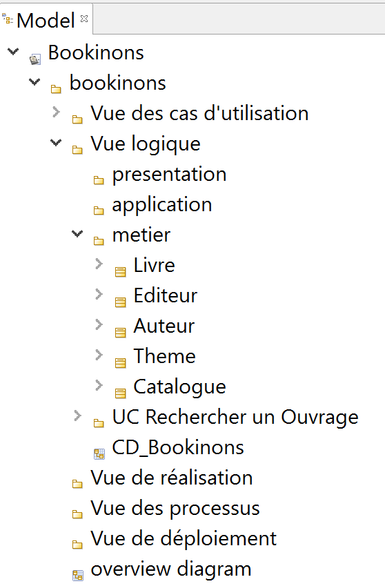


## Connaître les raccourcis autour du diagramme de classes  <a id="raccourcisDiagrammeClasses"></a>

Il existe des raccourcis pour créer plus facilement les diagrammes de classes.  

Le manuel utilisateur propose un tableau récapitulant les [raccourcis de création dans les diagrammes classes](http://forge.modelio.org/projects/modelio3-localization-usermanual-french-340/wiki/Modeler-_modeler_shortcuts_class_diagram)

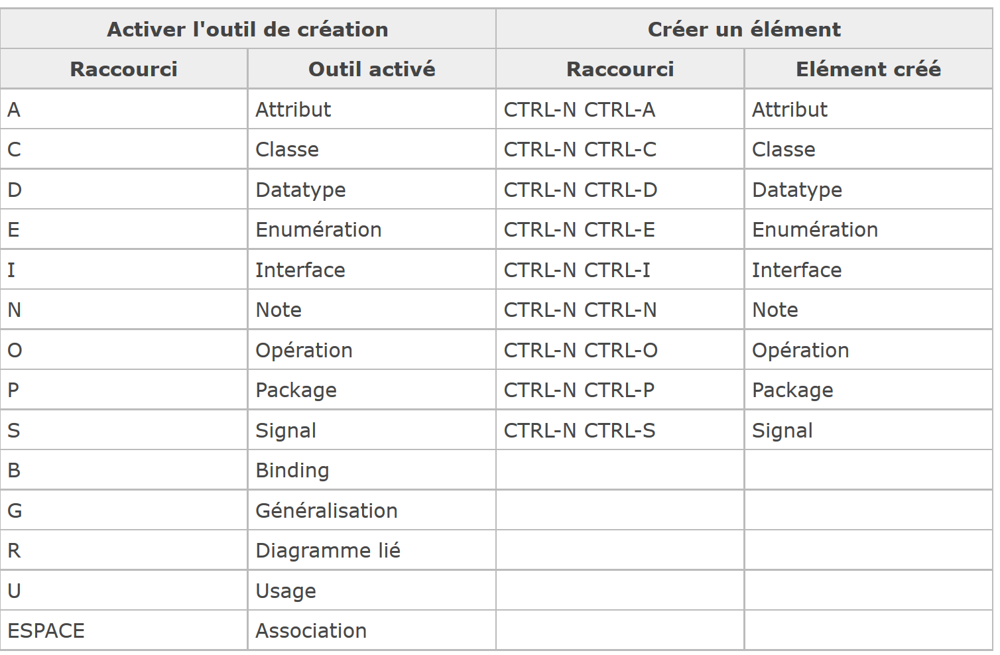

## Recenser les différents éléments spécifiques aux diagramme de classes <a id="elements_DiagClasses"></a>

#### D'après les spécifications officielles d'UML 

**Rappel:** Tous les éléments des diagrammes UML sont définis et illustrés dans le [Normative Documents](http://www.omg.org/spec/UML/2.5/PDF/).  
La dernière version est celle d'**UML 2.5**. Elle est disponible [ici](http://www.omg.org/spec/UML/2.5/)

Les chapitres **7.Common Structures**, **8.Values**, **9.Classification**, **10.Simple Classifiers** et **11.Structured Classifiers**  du [Normative Documents](http://www.omg.org/spec/UML/2.5/PDF/) traitent des différents éléments associés aux diagrammes de classes.

#### Sous Modélio

Pour un diagramme de classes, la palette graphique propose les éléments spécifiques suivants :

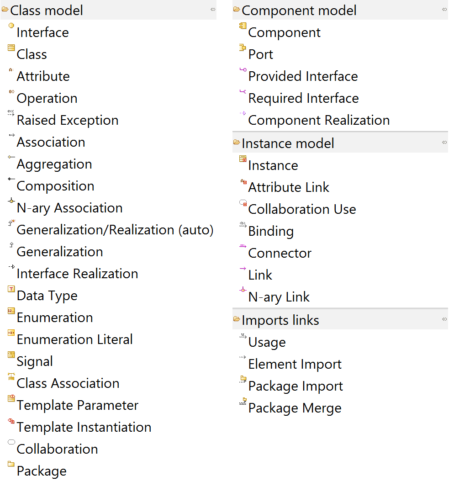

Ces éléments respectent la terminologie énoncée dans le [Normative Documents](http://www.omg.org/spec/UML/2.5/PDF/) (spécification d'UML). 


## Des exemples de diagrammes de classes réalisables avec Modelio <a id="exemples_DiagClasses"></a>

La rubrique [ressources du site ModelioSoft](https://www.modeliosoft.com/en/resources/diagram-examples.html) propose des exemples de diagrammes réalisés avec Modélio.

Les exemples concernant les diagrammes de classes sont disponibles  : [ici](https://www.modeliosoft.com/en/resources/diagram-examples/class-and-package-diagrams.html)


## Quelques mots sur les diagramme de classes dans la démarche d'analyse du cours <a id="analyseUML_DiagClasses"></a> 

Dans la démarche d'analyse pseudo-RUP adoptée, nous utiliserons deux types de diagrammes de classes :

* le Diagramme relatif aux Classes Persistantes de l'application (DCP)
* le Diagramme relatif aux Classes Participantes à un Use case (DCPU)

Et dans notre modélisation, nous trouverons donc :

* **un seul** diagramme de classes de persistantes qui sera commun à tous les UC de l'application
* et autant de diagrammes de classes de participantes que de UC dans l'application.

### Continuez le tutoriel par la prise en main des [diagrammes de séquence](Modelio_Sequences.md) 

