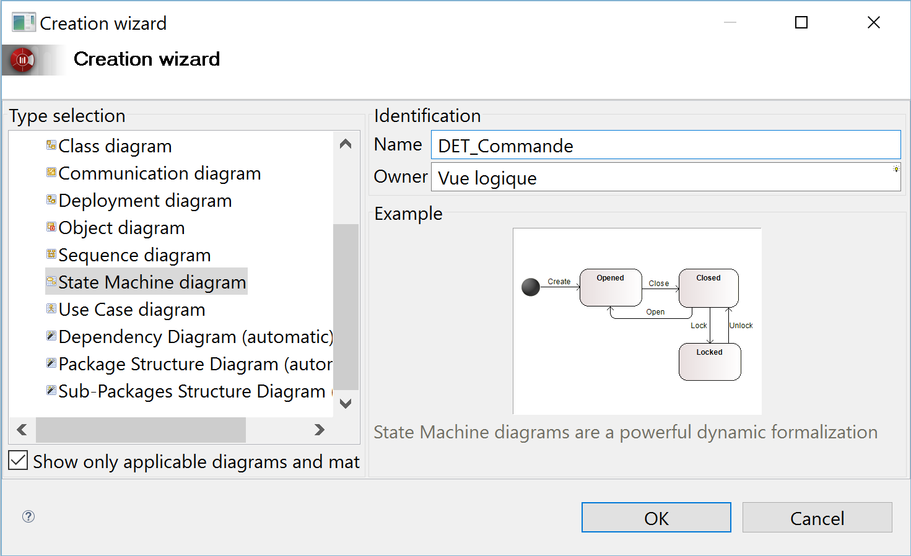
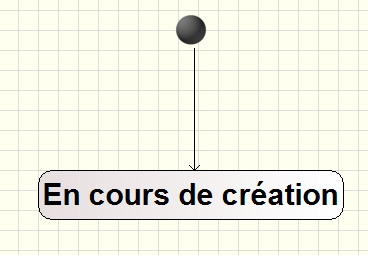
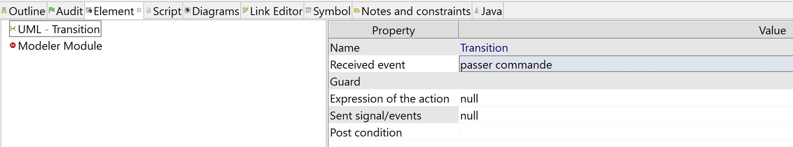
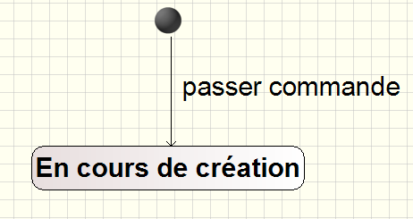
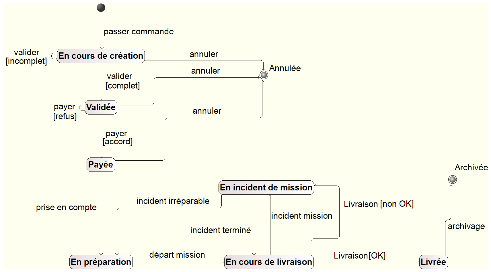
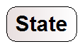
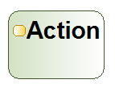
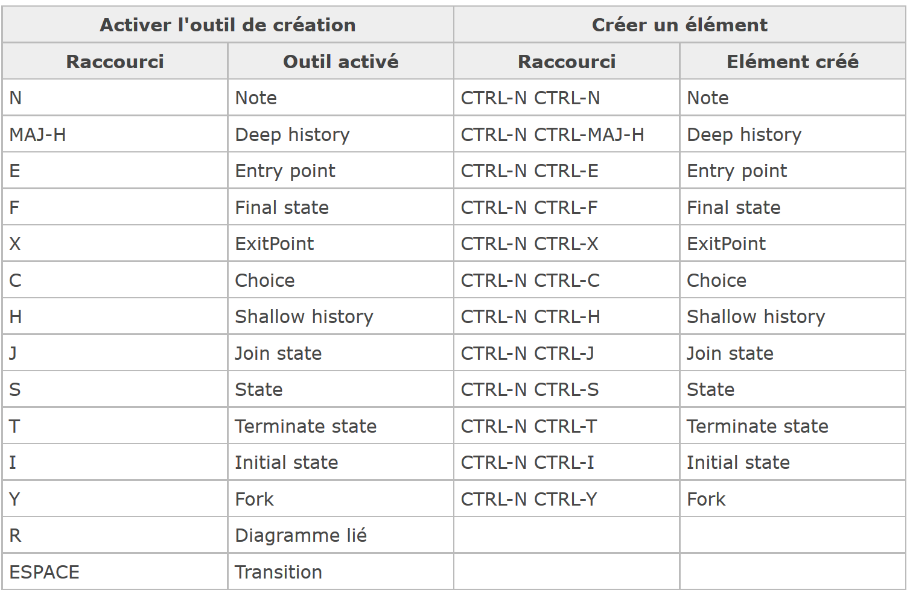
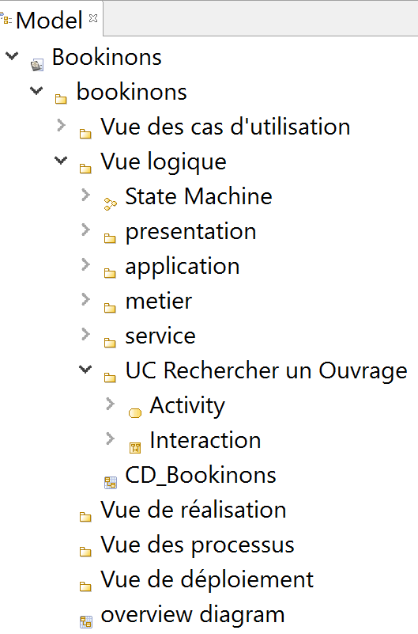

# Prise en main de Modélio : Diagrammes d'états

[Les diagrammes d'états décrivent les différents états d'un objet, ainsi que les transitions entre les états.](https://forge.modelio.org/projects/modelio-user-manual-french-22/wiki/Modeler-_modeler_diagrams_creating_diagram)

Nous considérons qu'arrivé(e) à ce point du tutoriel, vous avez réalisé les parties précédentes relative à la prise en main des [diagrammes de cas d'utilisation](Modelio_UseCase.md), des [diagrammes d'activités](Modelio_Activites.md), des [diagrammes de classes](Modelio_Classes.md) et des [diagrammes de séquence](Modelio_Sequence.md) et que vous savez comment redimensionner un élément, le renommer, changer son apparence, le supprimer, l'annoter,...

Dans ce tutoriel, nous verrons comment :

* [Créer un diagramme d'états](#creerDiagrammeEtats)
* [Paramétrer une transition](#parametrerTransition)
* [Connaître les raccourcis autour du diagramme d'états](#raccourcisDiagrammeEtats)

Et de manière autonome, vous allez :

* [Réaliser le diagramme d'états pour un objet de la classe `Commande`](#aVosCrayons_Exo1)

Nous finirons par :

* [Recenser les différents éléments spécifiques aux diagrammes d'états](#elements_DiagEtats)
* [Des exemples de diagrammes d'états réalisables avec Modelio](#exemplesDiagEtats)
* [Quelques mots sur les diagrammes d'états dans la démarche d'analyse du cours](#analyseUML_DiagEtats)

N'oubliez pas que vous pouvez, à tout moment, revenir consulter le [Zoom sur le manuel utilisateur](Modelio_UseCase.md#zoomManuelUtilisateurs) (récapitulatif de liens vers les différentes parties du manuel utilisateur utiles pour la création des diagrammes).

## Créer un diagramme d'états

Dans cette partie du tutoriel, nous allons réalisé le **diagramme d'états** relatifs aux objets de la classe **`Commande`**.  
Pour commencer, nous allons donc créé un nouveau diagramme d'états **DET_Commande** directement dans le package **`Vue Logique`**.

La création d'un diagramme de classes se fait de la [même manière que les diagrammes précédents](Modelio_UseCase.md#creerDiagrammeUC).  

Rendez-vous donc, dans de la vue **Model**, sur le package **`Vue logique`**, puis choisir à l'aide d'un clic droit **`Créer un diagramme ou une matrice…` dans le menu contextuel.  
Sélectionnez le type de diagramme **`State Machine diagram`**
Renommez-le, par exemple en **`DET_Commande`**.  
Cliquez sur **OK** pour valider la création du diagramme.

La **vue Modèle** est alors mise à jour avec le nom de notre nouveau diagramme : **DS_RechercherOuvrage`**.

**N'oubliez pas de sauvegarder régulièrement votre projet au cours de ce tutoriel...**

## Paramétrer une transition 

#### Des états et une transition pour commencer ...
Commencez par placer sur votre diagramme d'états, par glisser-déposer à partir de la palette graphique :

* un état initial (**`Initial State`**)
* un état (**`State`**) que vous renommerez **`En cours de création`**
* une transition (**`Transition`**) entre l'état initial et l'état **`En cours de création`** comme le montre la figure suivante :
*

#### Renseigner les propriétés d'une transition

Sélectionnez la transition et rendez-vous dans la **Vue Element**.  
Les propriétés de la transition permettent de paramétrer la transition.  
Par exemple, l'évenement déclencheur de cette première transition est **`passer commande`**. Renseignez la propriété **`Received event`** avec cette valeur comme le montre la figure ci-dessous.

**Remarque:** Une fois la valeur de la propriété **`Received event`** saisie, il est important d'appuyer sur la touche **Entrée** pour pouvoir valider cette valeur.
Faites un petit **`Ctrl + Espace`** pour en savoir plus, n'oubliez pas que l'autocomplétion est là pour cous aider ...

#### Montrer le label d'une transition

Ce paramétrage n'apparaît pas sur votre diagramme d'états. C'est normal.  
Par défaut le *label* de la transition est caché, pour le rendre *visible*, vous devez vous rendre dans la **Vue Symbol** de la transition et cocher la propriété **`Show label`** qui permet de faire apparaître sur la transition, entre autres, l'événement paramétré dans les propriétés comme le montre la figure ci-dessous : 

## Exercice : Réaliser le diagramme d'états pour un objet de la classe `Commande` 

Grâce à vos connaissances acquises sous Modélio lors de l'ellaboration des précédents diagrammes, vous devriez être en mesure de réaliser, de manière autonome, le diagramme d'états suivant :

**Remarque :** 

* Vous pouvez constater que le diagramme d'activité est très proche du diagramme d'états-transitions. Les 2 diagrammes se distinguent par leur domaine de prédilection :

	* plus proche des objets métiers pour le diagramme d'états-transitions.  

	* dynamique et plutôt orienté utilisateur pour le diagramme d'activité à base d'actions  

## Connaître les raccourcis autour du diagramme d'états  

Il existe des raccourcis pour créer plus facilement les diagrammes d'états.  

Le manuel utilisateur propose un tableau récapitulant les [raccourcis de création dans les diagrammes d'états](http://forge.modelio.org/projects/modelio3-localization-usermanual-french-340/wiki/Modeler-_modeler_shortcuts_state_diagram)

## Recenser les différents éléments spécifiques aux diagrammes d'états 

#### D'après les spécifications officielles d'UML 

**Rappel:** Tous les éléments des diagrammes UML sont définis et illustrés dans le [Normative Documents](http://www.omg.org/spec/UML/2.5/PDF/).  
La dernière version est celle d'**UML 2.5**. Elle est disponible [ici](http://www.omg.org/spec/UML/2.5/)

Les chapitres **14.StateMachines** du [Normative Documents](http://www.omg.org/spec/UML/2.5/PDF/) est relatif aux diagrammes d'états : entre autres, les différents éléments associés aux diagrammes d'états y sont détaillés et des exemples sont donnés.

#### Sous Modélio

Pour un diagramme d'états, la palette graphique propose les éléments spécifiques suivants :

Ces éléments respectent la terminologie énoncée dans le [Normative Documents](http://www.omg.org/spec/UML/2.5/PDF/) (spécification d'UML). 

## Des exemples de diagramme d'états réalisables avec Modelio 

La rubrique [ressources du site ModelioSoft](https://www.modeliosoft.com/en/resources/diagram-examples.html) propose des exemples de diagrammes réalisés avec Modélio.

Les exemples concernant les diagrammes d'états sont disponibles  : [ici](https://www.modeliosoft.com/en/resources/diagram-examples/state-diagrams.html)

## Quelques mots sur les diagrammes d'états dans la démarche d'analyse du cours  

En UML, un **diagramme d'états-transitions** représente une vue sur un objet : il décrit le **Cycle de Vie de l'Objet** c-à-d qu'il montre comment l'objet réagit à certains événements en fonction de son état courant et comment il passe dans un nouvel état.  
Le diagramme d’états-transitions UML vise donc à montrer les **différents états** et les **transitions** possibles des objets d'une classe à l'exécution.  

Il y aura donc **autant de diagrammes d'états-transitions que  d'objets complexes dans le système.**

De plus, comme un même objet peut intervenir dans plusieurs cas d'utilisations, le diagramme d'états-transitions est considéré comme un **diagramme inter Use-Case**.  
Les diagrammes d'états-transitions pourront donc se trouver directement à la racine de la vue logique au même niveau que les paquetages des Use Case ou dans un paquetage dédié.

#### Rappel de l'organisation de notre Vue Logique: 

* La vue logique contiendra **1 paquetage par Use Case**.

	* Il y aura **1 seul diagramme d'activité par Use Case**. Ce diagramme d'activité se trouvera dans la vue logique, dans le package correspondant au cas d'utilisation modélisé.

	* Il y aura **1 diagramme de séquence par Use Case** représentant le scénario nominal du Use Case. Evéntuellement des **diagrammes de séquence pour des flots alternatifs *délicats***. Ce(s) diagramme(s) de séquence se trouvera(ont) dans la vue logique, dans le package correspondant au cas d'utilisation modélisé. 

	* Il y aura également **1 diagramme de classes participantes par Use Case** qui se trouvera dans le package correspondant au cas d'utilisation modélisé.

* Un découpage en couches sera utilisé pour **stocker les classes**. Ce découpage comprendra au mimum les 3 paquetages suivants :  **`presentation`**, **`application`**, **`metier`**.

* Il y aura **1 diagramme de classes persistantes** *qui sera commun à tous les Use Case* de l'application et qui sera stocké directement à la racine de la vue logique au même niveau que les paquetages des Use Case car ce diagramme concerne tous les UC.

* Il y aura également **1 diagramme d'états-transitions** par objet complexe, directement stocké à la racine de la vue logique ou dans un paquetage dédié.

