# Prise en main de Modélio : Diagrammes de séquence

[Les diagrammes de séquence montrent la modélisation d'une logique séquentielle illustrant la façon dont les différents objets coopèrent.](https://forge.modelio.org/projects/modelio-user-manual-french-22/wiki/Modeler-_modeler_diagrams_creating_diagram)

Nous considérons qu'arrivé(e) à ce point du tutoriel, vous avez réalisé les parties précédentes relative à la prise en main des [diagrammes de cas d'utilisation](Modelio_UseCase.md), des [diagrammes d'activités](Modelio_Activites.md) et des [diagrammes de classes](Modelio_Classes.md) et que vous savez désormais comment redimensionner un élément, le renommer, changer son apparence, le supprimer, l'annoter,...

Dans ce tutoriel, nous nous verrons comment :

* [Créer un diagramme de séquence](#creerDiagrammeSequence)
* [Créer un objet](#creerObjet)
* [Créer un message](#creerMessage)
* [Créer un message réflexif](#creerMessageReflexif)
* [Paramétrer un message](#parametrerMessage)
* [Créer une interface](#creerInterface)
* [Connaître les raccourcis autour du diagramme de séquence](#raccourcisDiagrammeSequence)

Vous aurez quelques exercices à réaliser tout au long du tutoriel :

* [Positionner les premiers objets sur le diagramme](#aVosCrayons_Exo1)
* [Compléter le diagramme de séquence <a](#aVosCrayons_Exo2)

Nous finirons par :

* [Recenser les différents éléments spécifiques aux diagrammes de séquence](#elements_DiagSequence)
* [Des exemples de diagrammes de séquence réalisables avec Modelio](#exemplesDiagSequence)
* [Quelques mots sur les diagrammesde séquence dans la démarche d'analyse du cours](#analyseUML_DiagSequence)

N'oubliez pas que vous pouvez, à tout moment, revenir consulter le [Zoom sur le manuel utilisateur](Modelio_UseCase.md#zoomManuelUtilisateurs) (récapitulatif de liens vers les différentes parties du manuel utilisateur utiles pour la création des diagrammes).

## Créer un diagramme de sequence 

Dans cette partie du tutoriel, nous allons réalisé le **diagramme de séquence** décrivant le flot de base du UC **Rechercher un ouvrage**. Pour commencer, nous allons donc créé un nouveau diagramme de séquence **DS_RechercherOuvrage** dans le package **`UC Rechercher un Ouvrage`** du package **`Vue logique`**.

La création d'un diagramme de classes se fait de la [même manière que les diagrammes précédents](Modelio_UseCase.md#creerDiagrammeUC).  

Rendez-vous donc, dans de la vue **Model**, sur le package **`UC Rechercher un Ouvrage`** de **`Vue logique`**, puis choisir à l'aide d'un clic droit **`Créer un diagramme ou une matrice…` dans le menu contextuel.  
Sélectionnez le type de diagramme **`Sequence diagram`**
Renommez-le, par exemple en **`DS_RechercherOuvrage`**.  
Cliquez sur **OK** pour valider la création du diagramme.
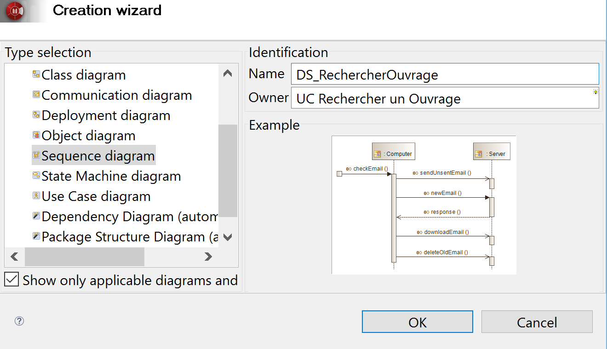

La **vue Modèle** est alors mise à jour avec le nom de notre nouveau diagramme : **DS_RechercherOuvrage`**.

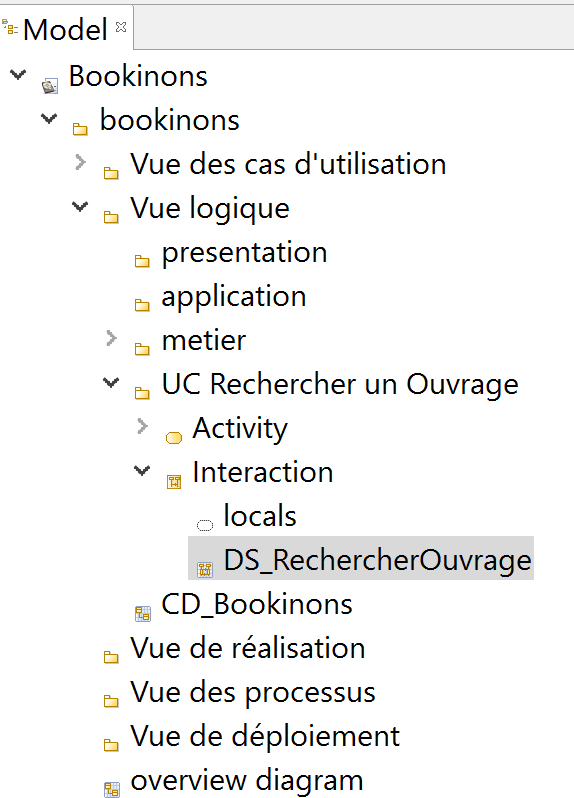

**N'oubliez pas de sauvegarder régulièrement votre projet au cours de ce tutoriel...**

#### Quelques mots sur le diagramme de séquence
Le **diagramme de séquence** est un **diagramme d'interaction** qui représente une **vue dynamique du système**.  
Le diagramme de séquence montre les **interactions entre les acteurs et le système** selon un **point de vue temporel** : il représente un ensemble de messages échangés entre les acteurs et le système, ordonnés chronologiquement.

## Creer un objet 

Cette partie sera constituée de trois partis :  

* Faire apparaître sur le diagramme un objet d'une classe déjà existante  
* Faire apparaître sur le diagramme un objet d'une classe non existante  
* Quelques mots à propos des stéréotypes  

### Faire apparaître sur le diagramme un objet d'une classe déjà existante

Dans la cadre de ce tutoriel, nous souhaitons modéliser le diagramme de séquence du **UC Rechercher un ouvrage** (flot nominal).  

**L' acteur sera donc le premier objet à positionner sur notre diagramme de séquence.**  
Il s’agit de **l'acteur principal** du UC qui va interagir avec le système.
Pour le use case **Rechercher un ouvrage** c'est l'**Internaute**.
C'est un élément déjà existant dans notre projet, puisque déjà créé lors du diagramme de cas d'utilisation 

Placez-vous donc dans la **vue Model** sur l'acteur **`Internaute`** (qui devrait se trouver dans un sous-package du package **Vue des scénarios**).  
Cliquez sur cet acteur et faites le glisser sur votre diagramme de séquence.    
Un objet **`r: Internaute`** avec une icône d'acteur apparaît alors dans le diagramme avec sa ligne de vie.

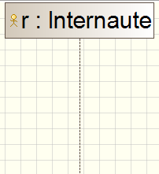

### Faire apparaître sur le diagramme un objet d'une classe non existante

Le deuxième objet de notre diagramme de séquence devra être une **interface graphique**.  
Cette classe permet à l'acteur d'interagir avec le système : c'est un dialogue qui devra se trouver dans la couche **presentation**.  

##### Creer une classe
Pour commencer, nous devons créer la classe qui permettra ensuite de générer cet objet sur notre diagramme de séquences.  

Rendez-vous donc dans la **Vue Logique`**, et placez-vous sur le paquetage **`presentation`** de  **Vue Logique`**.  
D'un clic droit sélectionnez (`Create element -> Class`).  
Renommez cette classe, par exemple en : **`RechercherOuvrageIHM`**

##### Faire apparaître l'objet sur le diagramme
Il ne vous reste plus qu'à la glisser-déposer sur votre diagramme pour qu'elle apparaisse au côté de la l'acteur **`Internaute`** déjà présent.

Un objet **`r1: RechercherOuvrageIHM`** avec une icône de classe apparaît alors avec sa ligne de vie.

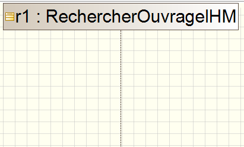

**Remarque :** 

* Un objet fraichement créé a un nom par défaut de type **rx**. Comme tout élément du diagramme, vous pouvez modifier son **nom** en utilisant la propriété **`name`** de la **vue Element**.

* Notez également que la propriété **`Represented by`** indique **`from locals`**, ce qui signifie que votre objet est bien liée à la classe de votre projet, et que tous les messages qui seront envoyés par votre objet au travers de ce diagramme seront automatiquement répercuter en opérations dans la classe dont il est issue c-a-d **`RechercherOuvrageIHM`** (Nous reviendrons sur ce point un peu plus loin).

### Quelques mots à propos des stéréotypes...

Dans la partie sur les diagramme de cas d'utilisation, nous avons déjà vu comment [ajouter un stéréotype à un élément](https://forge.modelio.org/projects/modelio3-localization-usermanual-french-340/wiki/Modeler-_modeler_building_models_add_stereotypes).  
***Remarque** : Un stéréotype de type **`<<boundary>>`** pourrait être associé aux objets de la **Vue** (IHM) du package **`presentation`***

Par défaut, les stéréotypes de Jacobson ne sont pas disponible dans Modélio.
Sachez qu'avec Modélio, il est toutefois possible de créer ses propres stéréotypes.  
Pour savoir comment faire, vous pouvez :

* consulter le manuel utilisation à la rubrique [Création d'un stéréotype](https://forge.modelio.org/projects/modelio3-localization-usermanual-french-340/wiki/Modeler-_modeler_mda_services_basic)
* et/ou visionner la vidéo : [Apprenez comment créer des stéréotypes](http://archive.modeliosoft.com/fr/quick-tour-fr/modelio-video-tutorials.html) des tutoriels vidéo Modelio (vidéo 13 Modelio MDA Designer Niveau basique).

Nous choisissons pour la suite de ce tutoriel de prise en main de ne pas utiliser de stéréoype.

## Exercice : Positionner les premiers objets sur le diagramme 

Nous avons choisi de modéliser le diagramme de séquence du flot de base du UC **Rechercher un ouvrage** selon un modèle **MVC** (**M**odèle **V**ue **C**ontroleur).

#### Le modèle MVC dans le diagramme de séquence
Après l'**acteur** et la **Vue** (interface garphique), le troisième objet que nous souhaitons positionner sur notre diagramme sera un **Contrôleur**.
Cette classe va *contrôler* et *orchestrer* l'application, nous la créerons dans le package **`application`**.  
***Remarque** : Un stéréotype de type **`<<control>>`** pourrait être associé aux objets de type **Contrôleur** .

Les objets suivants feront partie du **Modèle** et seront stockés dans le package **`metier`**.
***Remarque** : Plusieurs types de stéréotypes pourront être associés à ce type d'objets : **`<<entity>>`**, **`<<interface>>`**, ...

####  Positionner les objets

Dans le paquetage **`application`**, créer une classe **`RechercherOuvrageCtrl`** et faites apparaître un objet de cette classe comme troisième objet du diagramme de séquence. 

Faites apparaître un objet de la classe **`Catalogue`** du paquetage **`metier`**comme quatrième objet du diagramme de séquence.

Votre diagramme de séquence doit alors être similaire au suivant :

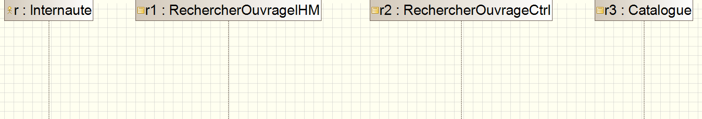

avec une **Vue Logique** similaire à :

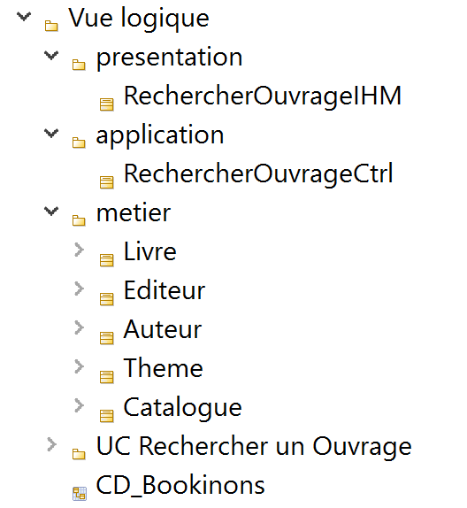

Vous venez de mettre en place le squelette du diagramme de séquence qui respecte un modèle **MVC** (une classe métier pour le **M**odèle, une classe IHM pour la **V**ue et une classe **C**trl pour le **C**ontrôle).Nous allons maintenant pouvoir représenter sur ce diagramme l'enchaînement des messages.

## Creer un message 

Dans le cadre de ce tutoriel, le diagramme de séquence va nous permettre de modéliser un des scénarios d'un Cas d'Utilisation. Nous souhaitons faire apparaître en *début* et en *fin* de diagramme des messages "conventionnés" pour bien montrer le début et la fin des actions du scénario. (c'est une convention qui nous est propre...)

Pour lancer le scénario, nous allons faire en sorte que l'acteur commence par lancer le message **`debut`** à l'IHM.  
Du point de vue de la conception objet, ***lancer un message synchrone à un objet revient à provoquer l'exécution d'une opération définie dans la classe de cet objet.***   
La classe **`RechercherOuvrageIHM`**  doit donc disposer d'une opération **`debut`** .

#### Ajouter une opération dans une classe
Rendez-vous donc dans la **`Vue Logique`**, et placez-vous sur la classe **`RechercherOuvrageIHM`** du paquetage  **`presentation`** de **`bookinons`**.  
D'un clic droit sélectionnez (`Create element -> Opération`).  
Renommez cette opération en : **`debut`**. Elle apparaîtra alors comme **`debut()`**.  
*Rappel : Par convention, une opération commencera par une minuscule.*

#### Nouveau message synchrone à partir d'une opération existante

Pour créer un nouveau message synchrone, il est possible d'utiliser la palette graphique.
Sélectionnez l'icône **`Synchronous Message`** du groupe **`Message`**

Cliquez sur l'objet à l'origine du message: l'acteur **`Internaute`**.
Cliquez sur l'objet destinataire du message: **`RechercherOuvrageIHM`**.

Rendez-vous ensuite dans la **vue Element** du message créé, grâce à la propriété **`Invoked`**, il ne vous reste plus qu'à choisir l'opération `debut` de la classe `RechercherOuvrageIHM` (**`RechercherOuvrageIHM::debut()`** pour faire apparaître le message sur votre diagramme de séquence de la manière suivante :

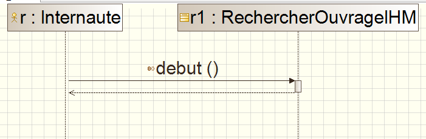

**Remarque:** Un raccourci clavier est également disponible pour créer plus rapidement un message. Il s'agit de **`ESPACE`**.

#### Transformation d'un nouveau message synchrone en opération pour enrichir la modélisation

Le second message que l'on souhaite représenter est le message **`rechercherDonneesPrealables`** qui va être envoyé de l'objet IHM vers l'objet Ctrl. 

Crééz un nouveau **`Synchronous Message`** entre **`RechercherOuvrageIHM`** et **`RechercherOuvrageCtrl`**.  
Rendez-vous dans la **vue Element** et dans la propriété **`Name`** saisir  : **`rechercherDonneesPrealables`**.  
Si vous consulter la classe **`RechercherOuvrageIHM`** dans la **vue Model**, vous constaterez que pour le moment aucune opération du même nom n'est présente dans cette classe.

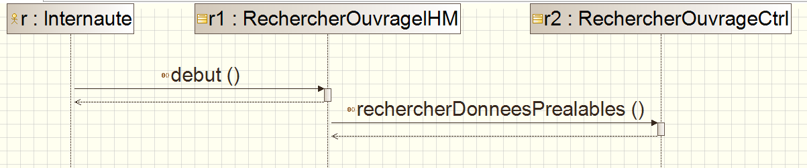

**Remarque:**  
Si le ***nom*** du message est saisi directement dans la propriété **`Name`** de la  **Vue Element**, aucune opération ne sera récpercutée/ajoutée à la classe.  
Or le but du diagramme de séquence est la découverte de nouveaux objets du système mais aussi l'enrichissement des classes en ajoutant notamment les opérations qui sont découvertes lors de l'ellaboration de ce diagramme.

Pour transformer un *nom* de message en **opération** de classe, il suffit de se positionner sur le message sur le diagramme de séquence, puis d'un clic droit sélectionnez (`Modeler Module -> Creer un operation depuis ce message`) et cliquez sur **`OK`**. L'opération est alors bien ajoutée à la classe **`RechercherOuvrageIHM`** comme l'indique la **vue Model** suivante :

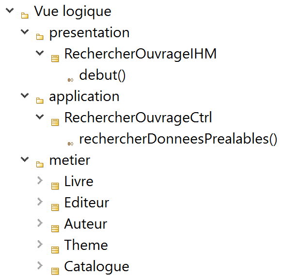

#### Zoom sur les différents types de messages disponible dans Modelio

En fonction de ses besoins, il est possible de modéliser avec Modélio, des messagges autresque des messages synchrones (**`Synchronous Message`**).    
Voici la liste des différents types de messages proprosés par la palette graphique :

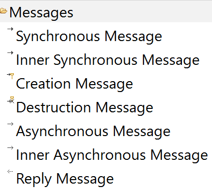

## Creer un message réflexif 

Depuis la **Vue Model**, ajouter dans la classe **`RechercherOuvrageIHM`**, une opération que vous appelerez **`afficherEcranDeRecherche`**.

Il est tout à fait possible qu'un objet s'envoie un message à lui-même : c'est ce que l'on appelle un **message réflexif**.

A partir d'un **`Synchronous Message`**, ajoutez le message réfléxif **`afficherEcranDeRecherche`** sur la ligne de vie de l'objet **`RechercherOuvrageIHM`**, de la manière suivante.  
**Remarque :** *Après l'ajout du message, nous avons volontairement supprimé (touche **`SUPPR`**) le focus d'activité et le message retour pour ne garder que le message réfléxif sur notre diagramme.*

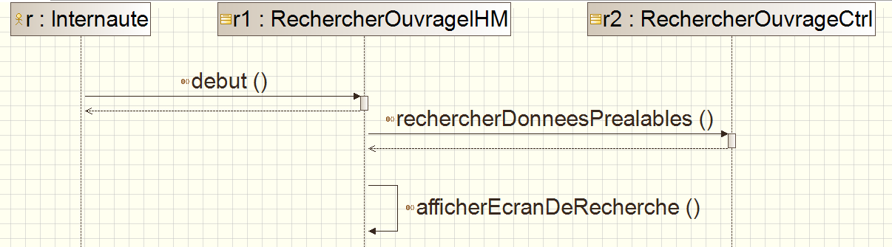

## Paramétrer un message 

Depuis la **Vue Model**, crééz dans la classe **`RechercherOuvrageIHM`**, une nouvelle opération que vous appelerez **`saisirMotsCles`**.

L'acteur est là pour interagir avec le système. 
Sur votre diagramme, créez un nouveau message **`saisirMotsCles`** invoquant cette opération et envoyé par l'acteur **`Internaute`** vers l'objet de la classe **`RechercherOuvrageIHM`**.  

#### Ajouter un paramètre à une opération
Pour passer un paramètre **`chaine`** à l'opération **`saisirMotsCles`**, il suffit maintenant de se placer dans la **Vue Model** sur la méthode **`saisirMotsCles`**, puis d'un clic droit de sélectionnez (`Create Element -> Parameter`). Un nouveau paramètre est créé. Ses propriétés peuvent être mises à jour via sa **Vue Element**.

Rien n'est apparu sur le diagramme de séquence… C'est normal !

#### Ajouter un paramètre à un message
Pour voir les paramètres d'un message sur le diagramme de séquence, il faut modifier la propriété **`Argument`** de la **Vue Element** du message. 

## Creer une interface 

Outre les acteurs et les classes, on peut trouver dans un diagramme de séquence des objets issus d'**interfaces**. 
Dans le cadre de ce tutoriel, nous avons choisi de regrouper ces objets dans un paquetage appelé **`service`**.  

Commencez donc par créer dans la **`Vue Logique`** de **`bookinons`** un nouveau package **`service`**.

#### Mise en place de l'interface `IRechercherNouveautes`

Rendez-vous donc dans la **`Vue Logique`**, et placez-vous sur le nouveau package **`service`** du paquetage.  
D'un clic droit sélectionnez (`Create element -> Interface`).  
Renommez cette interface en : **`IRechercherNouveautes`**. 
Elle apparait dans la **Vue Model** avec l'icône ronde de l'interface.

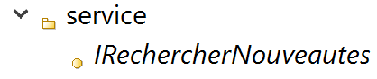

Sélectionnez l'interface dans la **Vue Model** puis faites glisser vers le diagramme de séquence pour obtenir le quatrième objet de votre diagramme.  
Remarquez que cet objet possède bien une icône d'interface.

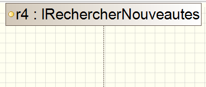

Depuis la **Vue Model**, ajoutez dans l'interface **`IRechercherNouveautes`**, une **opération** que vous appelerez **`rechercherAllNouveautes`**.

Sur votre diagramme, ajoutez en 3ème position un message invoquant l'opération **`rechercherAllNouveautes`** qui part du contrôleur (objet de type **`RechercherOUvrageCtrl`**) et qui arrive sur l'interface (objet de type **`IRechercherNouveautes`**) comme le montre le diagramme suivant :

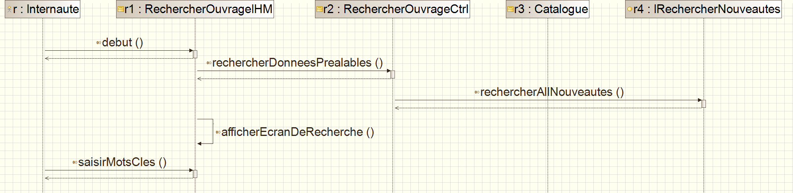

#### Et maintenant l'interface `IRechercherMeilleuresVentes` ...

De la même manière, créez une interface **`IRechercherMeilleuresVentes`** avec une **opération** **`rechercherAllMeilleuresVentes`** et insérez ce message dans votre diagramme afin d'obtenir une représentation similaire à la représentation suivante :

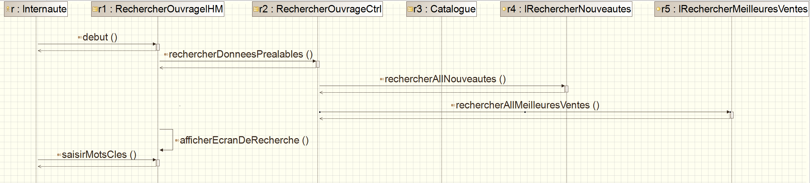

**Remarques :**

 * ***Rappel définition d'une interface*** : Au sens UML, une **interface** est un **ensemble d’opérations utilisé pour spécifier le service** (contrat) d'une classe ou d'un composant. Une interface ne peut définir **ni attribut, ni association navigable vers d'autres classes** et toutes les **opérations** d’une interface sont **abstraites**.
 * En principe, on choisit de représenter une interface sur un diagramme de séquence lorsque le service demandé est un service extérieur à l'application.  
 * Il est souvent recommandé de faire commencer le nom de l'interface  avec la lettre **`I`**.
 * Si vous le souhaitez, vous pouvez faire apparaître le stéréotype **`<<interface>>`** pour de tels objets.

## Exercice : Compléter le diagramme de séquence 

Pour vous entraîner, vous compléter votre diagramme de séquence de la manière suivante, de façon à modéliser le flot de base du cas d'utilisation ***Rechercher un ouvrage***:  

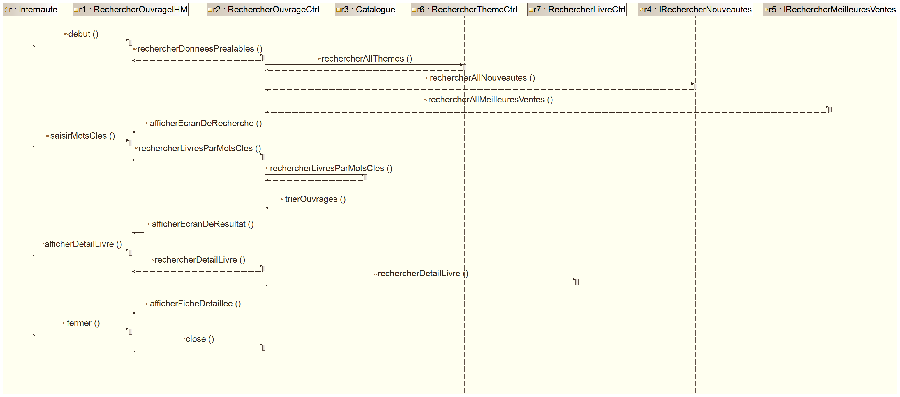

**Remarque :** Les classes **`RechercherLivreCtrl`** et  **`RechercherThemeCtrl`** seront stockées dans le paquetage **`application`** .

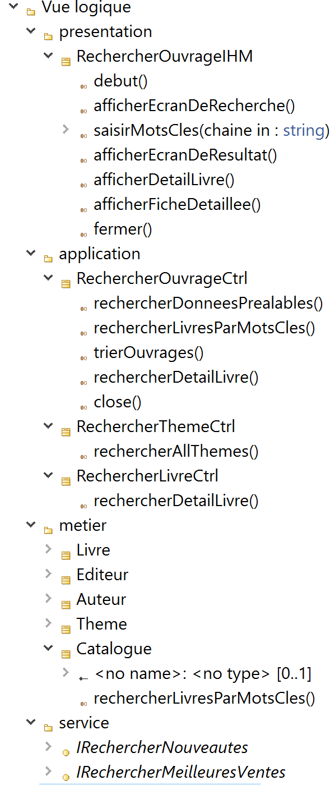

## Connaître les raccourcis autour du diagramme de séquence  

Il existe des raccourcis pour créer plus facilement les diagrammes de séquence.  

Le manuel utilisateur propose un tableau récapitulant les [raccourcis de création dans les diagrammes de communication](http://forge.modelio.org/projects/modelio3-localization-usermanual-french-340/wiki/Modeler-_modeler_shortcuts_communication_diagram)

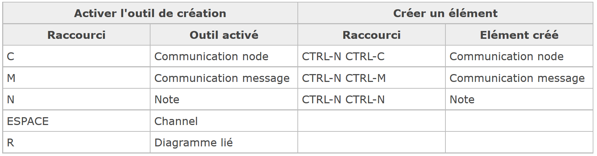

## Recenser les différents éléments spécifiques aux diagrammes de séquence 

#### D'après les spécifications officielles d'UML 

**Rappel:** Tous les éléments des diagrammes UML sont définis et illustrés dans le [Normative Documents](http://www.omg.org/spec/UML/2.5/PDF/).  
La dernière version est celle d'**UML 2.5**. Elle est disponible [ici](http://www.omg.org/spec/UML/2.5/)

Les chapitres **17.Interactions** du [Normative Documents](http://www.omg.org/spec/UML/2.5/PDF/) est relatif aux diagrammes d'interaction (diagrammes de séquence, diagramme de communication, diagramme global d'interaction et diagramme de temps) : entre autres, les différents éléments associés aux diagrammes de séquence y sont détaillés et des exemples sont donnés.

#### Sous Modélio

Pour un diagramme de séquence, la palette graphique propose les éléments spécifiques suivants :

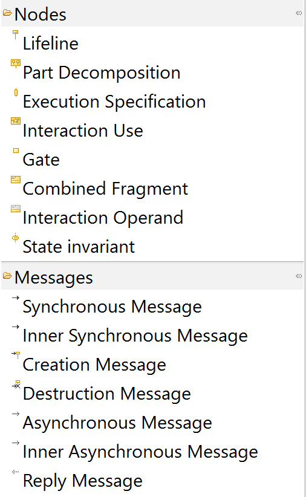

Ces éléments respectent la terminologie énoncée dans le [Normative Documents](http://www.omg.org/spec/UML/2.5/PDF/) (spécification d'UML). 

## Des exemples de diagrammes de séquence réalisables avec Modelio 

La rubrique [ressources du site ModelioSoft](https://www.modeliosoft.com/en/resources/diagram-examples.html) propose des exemples de diagrammes réalisés avec Modélio.

Les exemples concernant les diagrammes de séquence sont disponibles  : [ici](https://www.modeliosoft.com/en/resources/diagram-examples/sequence-diagrams.html)

La vidéo ***11 – Développement Java piloté par le modèle avec Modelio*** des **tutoriels vidéos** propose un exemple de diagramme de séquence. Elle est disponible [ici](http://archive.modeliosoft.com/fr/quick-tour-fr/modelio-video-tutorials.html)

## Quelques mots sur les diagramme de séquence dans la démarche d'analyse du cours  

En général, un diagramme de séquence permet de représenter graphiquement un scénario en particulier , montrant ainsi la logique de déroulement des actions décrites. 
Il est d’usage de modéliser d’abord le flot de base, puis le ou les flots alternatifs,
Chaque cas d'utilisation pourra être décrit par un ou plusieurs diagrammes de séquence.

Nous allons commencer par représenter le diagramme de séquence décrivant le flot de base du UC Rechercher un ouvrage. Ajouter dans le package UC Rechercher un ouvrage un diagramme de séquence (Sequence Diagram) que vous appelerez DS_RechercherOuvrage. 
Ce diagramme devient alors le diagramme actif de votre fenêtre de travail.

Comme indiqué [ici](https://www.modeliosoft.com/fr/ressources/exemples-de-diagrammes/diagrammes-de-sequence.html), *UML2 a considérablement amélioré les diagrammes de séquence. Il est désormais possible de référencer d'autres diagrammes de séquence UML, de représenter des boucles et des choix, de définir des paramètres formels et actuels d'appel (gates), et ainsi de suite.*
Grâce à ces nouvelles notations, certains flots alternatifs pourraient donc très bien être également représentés sur le même diagramme de séquence que le flot nominal. 

### Continuez la tutoriel par la prise en main des [diagrammes de d'états](Modelio_Etats.md) 