# Prise en main de Modélio : Diagrammes de cas d'utilisation (Use Case)

[Les diagrammes de cas d’utilisation montrent les cas d'utilisation, les acteurs et les transitions, afin de décrire les services principaux rendus par le système.](https://forge.modelio.org/projects/modelio-user-manual-french-22/wiki/Modeler-_modeler_diagrams_creating_diagram)

Dans ce tutoriel, nous verrons comment :

* [Créer un diagramme de cas d'utilisation](#creerDiagrammeUC)
* [Créer un acteur](#creerActeur)
* [Choisir un stéréotype](#choisirStereotype)
* [Changer l'apparence (propriétés graphiques)](#proprietesGraphiques)
* [Supprimer un acteur](#supprimerActeur)
* [Créer un cas d'utilisation](#creerUseCase)
* [Créer un lien](#creerLien)
* [Aligner des éléments](#alignerElements)
* [Représenter la navigabilité](#navigabilite)
* [Connaître les raccourcis autour du diagramme de cas d'utilisation](#raccourcisDiagrammeUC)
* [Annoter un élément](#annoterElement)
* [Créer un acteur généralisé](#creerActeurGeneralise)
* [Créer une relation d'inclusion entre deux cas d'utilisation](#creerRelationInclusion)
* [Créer une relation d'extension entre deux cas d'utilisation](#organiserPackage)
* [Organiser les cas d'utilisation en *Package*](#creerRelationExtension)
* [Copier un diagramme en tant qu'image](#copierDiagramme)

Vous aurez quelques exercices à réaliser tout au long du tutoriel :

* [Commencer par les cas d'utilisation autour de l'acteur `Internaute`](#aVosCrayons_Exo1)
* [Compléter votre diagramme de cas d'utilisation ...](#aVosCrayons_Exo2)
* [Finaliser votre diagramme de cas d'utilisation ...](#aVosCrayons_Exo3)

Nous finirons par :

* [Recenser les différents éléments spécifiques aux diagramme de cas d'utilisation](#elements_DiagUC) => A FAIRE !!!!
* [Des exemples de diagrammes de cas d'utilisation réalisables avec Modelio](#exemples_DiagUC)
* et [Quelques mots sur l'*approche vue 4+1](#approche_4_1)

Avant de proposer un récapitulatif de liens vers les différentes parties du manuel utilisateur utiles pour la création des diagrammes de cas d'utilisation :
 
* [Zoom sur le manuel utilisateur...](#zoomManuelUtilisateurs)

## Créer un diagramme de cas d'utilisation 

### Un petit coup d'oeil sur le manuel utilisateur...

Le manuel utilisateur indique qu'il existe deux façons de créer un diagramme sous Modélio :  

* soit en utilisant la commande **`Créer un diagramme ou une matrice…`** du menu contextuel 
* soit en en utilisant la **barre d'outil de création rapide** de la barre d'outil.

Avant de continuer et afin de visualisez ces différentes possibilités dans votre fenêtre de travail, jetez un petit coup d'oeil à la rubrique **Créer un diagramme** du manuel utilisateur disponible : [ici](http://forge.modelio.org/projects/modelio3-localization-usermanual-french-340/wiki/Modeler-_modeler_diagrams_creating_diagram) 

### Et maintenant à vous de jouer... 

Dans la **[vue Modèle](http://forge.modelio.org/projects/modelio3-localization-usermanual-french-340/wiki/Modeler-_modeler_interface_uml_view)** de votre fenêtre de travail, sélectionnez l'élément sous lequel vous souhaitez créer un diagramme, pour nous ce sera le dossier `Bookinons`.  
Après un clic droit, choisir **`Créer un diagramme ou une matrice…` du menu contextuel.  
Sélectionnez le type de diagramme **`Use Case diagram`**
Changez le nom du diagramme, par exemple en **`Bookinons UC`**.  
Vérifiez que le propriétaire du diagramme est bien **bookinons** c-a-d l'élément sélectionné au départ.
Cliquez sur **OK** pour valider la création du diagramme.
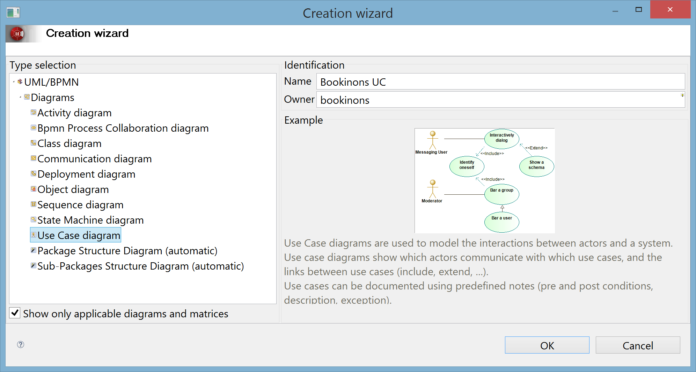

La **[vue Modèle](http://forge.modelio.org/projects/modelio3-localization-usermanual-french-340/wiki/Modeler-_modeler_interface_uml_view)** est alors mise à jour avec le nom de notre nouveau diagramme : **Bookinons UC** en dessous du dossier **bookinons**.  

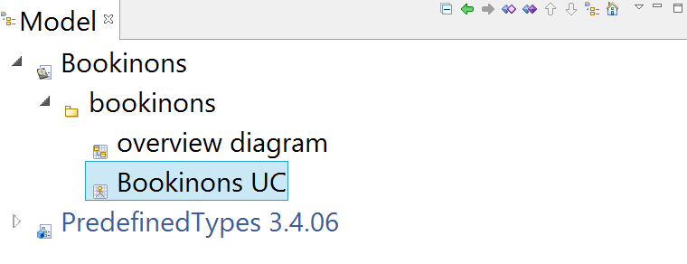

<!-- [Vue Modele après création diagramme UC](images/DiagUC_VueModele.png) -->

Un nouvel onglet **Bookinons UC** apparaît également dans la **[vue “Edition des diagrammes”](http://forge.modelio.org/projects/modelio3-localization-usermanual-french-340/wiki/Modeler-_modeler_interface_edition_view)**.  
Des palettes graphiques propres aux cas d'utilisations sont associés à cet onglet comme ***Nodes*** pour ce qui concerne les acteurs ou ***Links*** pour les différentes relations.

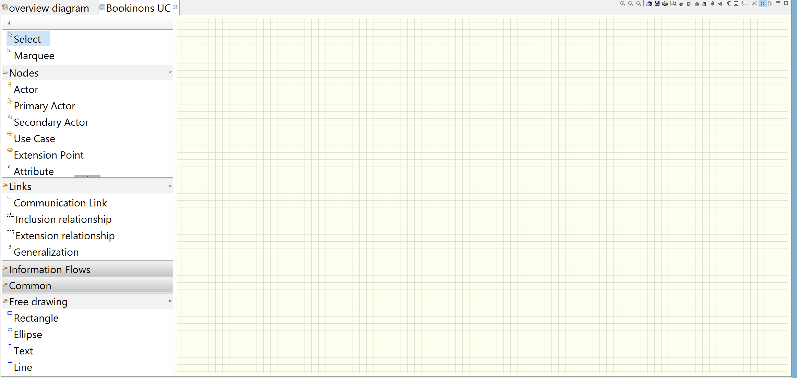

 
**N'oubliez pas de sauvegarder régulièrement votre projet au cours de ce tutoriel...**

## Créer un acteur 

### Un petit coup d'oeil sur le manuel utilisateur...

Le manuel utilisateur indique qu'il existe trois façons de créer un élément dans un diagramme sous Modélio :  

* soit en utilisant la commande **`Créer un élément`** du menu contextuel.
* soit en utilisant les **icônes de la palette** des diagrammes.
* soit en utilisant le **glisser-déposer depuis l'explorateur** vers les diagrammes.

Avant de continuer, visualisez ces différentes possibilités en jetant un petit coup d'oeil à la rubrique **Créer un élément** disponible : [ici](https://forge.modelio.org/projects/modelio3-localization-usermanual-french-340/wiki/Modeler-_modeler_building_models_creating_elements) 

Un **acteur** (**`Actor`**) est un ***élément de type *noeud***.    
Dans Modelio, l'élément **`Actor`** est associé au groupe **`Nodes`** de la palette graphique, comme nous le montre la **vue “Edition des diagrammes”**. 
 
La rubrique **Créer des éléments de type *noeud*** est disponible : [ici](https://forge.modelio.org/projects/modelio3-localization-usermanual-french-340/wiki/Modeler-_modeler_building_models_creating_elements_diagpalette).  
Elle nous apprend que Modelio dispose d'un **“expert de modélisation”**, qui fournit une aide en temps réel lors de la création d'éléments dans les diagrammes.

Nous allons commencer par **créer un acteur sur notre diagramme de Use case via la palette d'icônes**, veuillez jeter un petit coup d'oeil préalablement [ici](http://forge.modelio.org/projects/modelio3-localization-usermanual-french-340/wiki/Modeler-_modeler_diagrams_creating_elements)

### Et maintenant à vous de jouer... 

#### Nouvel acteur
Pour ajouter un nouvel **acteur** sur votre **diagramme de Use Case**, commencez par ouvrir le groupe **Nodes** de la palette graphique de la **vue “Edition des diagrammes”**.
 
Cliquez ensuite sur l'icône **Actor** dans la palette du diagramme.
Rendez-vous ensuite sur le fond du diagramme (quadrillage jaune qui va contenir le diagramme),
un **clic gauche** permet de faire apparaître à l'endroit, où vous venez de cliquer, un **acteur** sur ce diagramme sous sa forme **stick man** :  
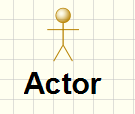 

Consultez ensuite la **[vue Modèle](http://forge.modelio.org/projects/modelio3-localization-usermanual-french-340/wiki/Modeler-_modeler_interface_uml_view)**  pour constater que l'acteur **Actor** a bien été ajouté. Il apparaît sous `bookinons` et précédé d'une icône de *stickman*. 

#### Renommer un acteur
Le nom **Actor** est attribué par défaut à cet acteur. 
Pour renommer un élément du diagramme, plusieurs possibilités existent.

* la plus simple consiste à sélectionner l'élément directement sur le diagramme puis à appuyer sur **`F2`**. Le nom de l'élément est alors surligné et vous pouvez saisir un nouveau nom directement,

mais il est également possible de renommer un élément ...

* depuis la **[vue Modèle](http://forge.modelio.org/projects/modelio3-localization-usermanual-french-340/wiki/Modeler-_modeler_interface_uml_view)** où il suffit simplement de cliquer sur l'élément pour le renommer
* depuis la **[vue Element](http://forge.modelio.org/projects/modelio3-localization-usermanual-french-340/wiki/Modeler-_modeler_building_models_modifying_element_props)** (onglet en bas de la fenêtre de travail), où il suffit de modifier la valeur de la propriété *Name*. La vue Element permettra de modifier, d'une manière générale, toutes les propriétés d'un élément.
* depuis le **diagramme**, en double cliquant sur l'acteur, où ne fenêtre **Edition** s'ouvre permettant de modifier la valeur de la propriété *Name*.

Choisissez une de ces méthodes pour attribuer le nom d'**`Internaute`** à votre premier acteur.

#### Redimensionner un acteur

Pour [modifier la taille d'un élément dans un diagramme](http://forge.modelio.org/projects/modelio3-localization-usermanual-french-340/wiki/Modeler-_modeler_diagrams_changing_element_size) une fois créé, il suffit de sélectionner l’un des points de contrôle qui l’entourent et de le glisser jusqu’à ce l'élément atteigne la taille souhaitée.

Redimensionnez le stick man, puis son nom pourqu'**Internaute** devienne lisible en entier.

***Remarque:*** Il est possible de [redimensionner un nouvel élément lors de sa création](http://forge.modelio.org/projects/modelio3-localization-usermanual-french-340/wiki/Modeler-_modeler_diagrams_creating_elements). Pour cela, il suffit de maintenir enfoncé le bouton gauche de la souris lorsque de la création, et de glisser le curseur jusqu'à ce que le nouvel élément ait la taille souhaitée.

 

## Choisir un stéréotype 

Il existe plusieurs représentations graphiques pour un acteur.  
Par défaut, l'*Actor* est représenté sous sa forme ***stick man*** , mais on peut également choisir de représenter l'acteur ***sous forme rectangulaire***. On réserve d'ailleurs généralement cette dernière notation pour les ***systèmes dits connectés***.

Commencez par ajouter un nouvel acteur sous forme de *stickman* sur votre diagramme.   
Nommez cet acteur **`Paiement Securisé`**. 

Sélectionnez l'acteur que vous venez de créer et à l'aide d'un clic droit ouvrez le menu contextuel **`Add stereotype`**.
Sélectionnez le stéréotype **`<<System>>`** dans la liste et validez en cliquant sur **`OK``**.

Le stéréotype **`<<System>>`** est alors ajouté sur le diagramme au dessus du nom de l'acteur.
L'icône précédant le nom de l'acteur dans l'arobrescence de la **vue Modèle** change également en fonction du stéréotype choisi.

### Un petit coup d'oeil sur le manuel utilisateur...
Consulter la rubrique [Ajouter des stéréotypes aux éléments](http://forge.modelio.org/projects/modelio3-localization-usermanual-french-340/wiki/Modeler-_modeler_building_models_add_stereotypes) pour retrouver ce protocole en images.
Vous remarquerez qu'il est existe un autre moyen pour ajouter un stéréotype : il s'agit de passer par la **vue “Elément”** et de cliquer sur l'icône **`Add stereotype(s)...`**.

## Changer l'apparence (propriétés graphiques) 

Pour changer l'apparence de l'acteur, il faut tout d'abord commencer par le sélectionner.  

Rendez-vous ensuite sur la [vue Symbole](http://forge.modelio.org/projects/modelio3-localization-usermanual-french-340/wiki/Modeler-_modeler_diagrams_graphic_options) de cet élément (onglet en bas de votre fenêtre de travail).

Pour changer l'apparence, il suffit de changer la propriété : **`Representation mode`**.

Commencez par choisir la valeur **`Image`** de cette propriété.
C'est l'image du stéréotype qui s'affiche, la même que celle qui est affichée dans la vue Modèle.  
Comme dans notre cas, nous venons de choisir un stéréotype `<<System>>` l'image doit correspondre à ce stéréotype.

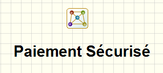 
 
Essayez ensuite la valeur **`Structured`** pour la propriété **`Representation mode`**.

Si on souhaite obtenir la même représentation que la figure ci-dessous, vous devez supprimer le stéréotype. Pour cela, rendez-vous dans la **vue Element**, Sélectionnez **<<System>>** et appuyez sur la touche **Suppr**.

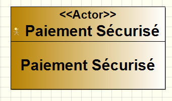

La **vue Symbole** permet également de modifier d'autres propriétés graphiques comme la couleur ou l'affichage de certaines propriétés.

Rendez-vous, par exemple, sur la propriété **`Name dislay mode`** et choisissez comme nous valeur : **`Hidden`**. Vous obtiendrez alors une représentation de l'acteur **Paiement Sécurisé** similaire à la figure ci-dessous.

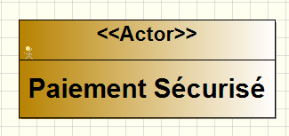

### Un petit coup d'oeil sur le manuel utilisateur...
Consulter la rubrique [Définir les options graphiques dans les diagrammes](http://forge.modelio.org/projects/modelio3-localization-usermanual-french-340/wiki/Modeler-_modeler_diagrams_graphic_options) pour obtenir plus de détails sur la **vue Symbole** qui permet de visualiser et éditer les propriétés graphiques des éléments d'un diagramme et du diagramme lui-même ...   

Par exemple, si vous souhaitez supprimer la grille à l'arrière du diagramme.  
Cliquez quelque part sur le diagramme, sélectionnez la **vue Symbole** et décochez la propriété **View Grid**.

## Supprimer un acteur 

La rubrique [Gérer les éléments dans un diagramme](https://forge.modelio.org/projects/modelio3-localization-usermanual-french-340/wiki/Modeler-_modeler_diagrams_handling_elements) du manuel utilisateur indique deux possibilités pour supprimer un élément d'un diagramme :

* soit sélectionner l'élément dans le diagramme, puis appuyer sur la touche **Suppr** 
* soit cliquer-droit sur l’élément dans le diagramme pour ouvrir son menu contextuel et choisir **`Delete selection`**

**A vous de jouer...**
Créez un nouvel acteur sur votre diagramme et supprimez le aussitôt ...

Lors de la suppression, n'oubliez pas remarquer que la **vue Modèle** est automatiquement mise à jour afin d'assurer la cohérence du modèle.

## Créer un cas d'utilisation 

Un **cas d'utilisaton** (**`Use Case`**) est un ***élément de type *noeud***.  
Dans Modelio, l'élément **`Use Case`** est associé au groupe **`Nodes`** de la palette graphique, le même que celui d'un **`Actor`**.

Pour ajouter un nouveau **cas d'utilisation** sur le **diagramme de Use Case**, nous procéderons donc comme pour un **`Actor`**.

#### Nouveau cas d'utilisation
Commencez par ouvrir le groupe **Nodes** de la palette graphique de la **vue “Edition des diagrammes”**.
 
Cliquez ensuite sur l'icône **Use case** dans la palette du diagramme.
Rendez-vous sur le fond du diagramme (quadrillage jaune qui va contenir le diagramme) et faites apparaître le cas d'utilisation par un **clic gauche**.

Consultez la **[vue Modèle](http://forge.modelio.org/projects/modelio3-localization-usermanual-french-340/wiki/Modeler-_modeler_interface_uml_view)**  pour constater que le cas d'utilisation **Use Case** (nom donné par défaut) a bien été ajouté et apparaît dans l'arborescence sous `bookinons`.

#### Renommer le cas d'utilisation
Sélectionnez le cas d'utilisation puis appuyez par sur **`F2`** pour renommer simplement le cas d'utilisation en **`Rechercher Ouvrage`**.

#### Redimensionner le cas d'utilisation

Redimensionnez le cas d'utilisation **`Rechercher Ouvrage`** en utilisant les points de contrôle qui apparaissent après un clic sur l'élément

#### Modifier le mode de représentation d'un cas d'utilisation

Comme pour un acteur, vous pouvez modifier le mode de représentation d'un cas d'utilisation, à partir de la [vue Symbole](http://forge.modelio.org/projects/modelio3-localization-usermanual-french-340/wiki/Modeler-_modeler_diagrams_graphic_options) (en bas de votre fenêtre de travail), en changeant la valeur de la propriété **`Representation mode`**.

Le **mode représentation** *classique* pour un cas d'utilisation est **`Structured`** comme le montre la figure ci-dessous.

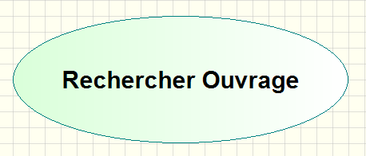

## Créer un lien 

La **modélisation complète du cas d'utilisation *Rechercher Ouvrage*** est la suivante :

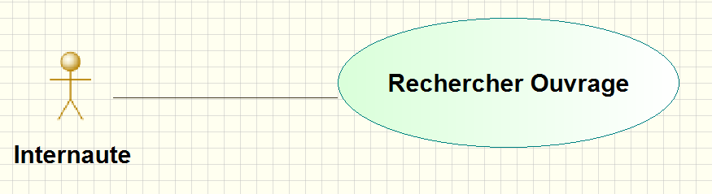

Cette modélisation nécessite la présence de **3 éléments** :

* un **acteur** c-a-d un élément de type ***Actor*** (`Internaute` pour ce UC )
* un **cas d'utilisation** c-a-d un élément de type ***Use Case*** (`Rechercher Ouvrage` pour ce UC)
* ET un **lien** entre l'**acteur** et le **cas d'utilisation**.

Sur notre diagramme, nous disposons déjà des éléments de type ***Actor*** et de type ***Use Case***. 
Il ne nous reste plus qu'à ajouter lien entre `Internaute` et `Rechercher Ouvrage`.

Le **lien de communication** que nous allons établir entre l'**acteur** (**`Actor`**) et le **cas d'utilisation** (**`Use case`**) sera disponible, sous Modelio, dans le groupe **`Links`** de la palette graphique dans la **vue “Edition des diagrammes”**. 

**A vous de jouer...**
Cliquez sur `Communication Link` dans le groupe **`Links`** de la palette graphique.  
Cliquez sur l'**Actor** (`Internaute`), le point d'origine de votre lien (qui devient vert s'il est *cliquable*)
Cliquez sur le **Use Case** (`Rechercher Ouvrage`), le point de destination de votre lien (qui devient vert s'il est *cliquable*)
 
Ce protocole est décrit et illustrer dans la rubrique **Créer des *liens* dans un diagramme** du manuel utilisateur est disponible : [ici](https://forge.modelio.org/projects/modelio3-localization-usermanual-french-340/wiki/Modeler-_modeler_building_models_creating_links_diagrams). 

## Aligner des éléments 

Pour mettre en forme vos modèles, il est fort utile de savoir comment aligner des éléments ...

Pour aligner des éléments, Modelio propose plusieurs options d’alignement.  
Les icônes correspondant aux différents choix d'alignement sont disponible dans la barre d'outils du diagramme en haut à gauche de la **[vue “Edition des diagrammes”](http://forge.modelio.org/projects/modelio3-localization-usermanual-french-340/wiki/Modeler-_modeler_interface_edition_view)** et sont décrites : [ici](https://forge.modelio.org/projects/modelio3-localization-usermanual-french-340/wiki/Modeler-_modeler_diagrams_aligning)

Pour procéder à un alignement, il est necessaire d'avoir sélectionner au préalable plusieurs éléments.  
Pour sélectionner rapidement plusieurs éléments d'un même diagramme, vous pouvez, par exemple, maintenir la touche **`Maj`** appuyée en sélectionnant vos différents éléments. (D'autres possibilités sont décrites [ici](https://forge.modelio.org/projects/modelio3-localization-usermanual-french-340/wiki/Modeler-_modeler_diagrams_handling_elements))

## Exercice : Commencer par les cas d'utilisation autour de l'acteur `Internaute` 

Afin de mettre en pratique tout ce qui prècède, compléter votre diagramme de Use Case jusqu'à l'obtention du diagramme suivant :

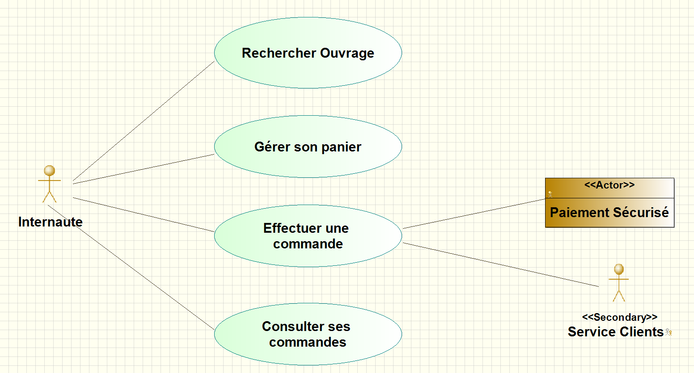

**Remarque :**
 
* Veillez à bien aligner vos cas d'utilisation.
* Veillez à ce qu'il soit tous de la même longueur : N'hésitez pas à tester les différentes options de mise en forme offertes par les icônes en haut à gauche de la vue Edition des diagrammes, celles juste à côté des icônes d'alignement...

## Représenter la navigabilité 

Un **lien** est un élément du diagramme.  
Au même titre que les acteurs, il dispose d'une **vue Symbole** et d'une **vue Element** qui permettent de le paramétrer si besoin est.

Pour faire apparaître la **navigabilité** d'un lien sur la diagramme, il faut sélectionner le lien, puis cocher la propriété **`show navigability`** d'**`Association`** disponible dans la **vue Symbole**.  
La navigabilité (flèche sur le lien de communication) sera alors ajoutée à la destination du lien.  
*Conseil: choisissez judicieusement l'origine et la destination de votre lien, si vous souhaitez visualiser la navigabilité par la suite ...*

Sur le diagramme précédent, rajoutez la navigabilité entre le cas d'utilisation `Effectuer une commande` et l'acteur `Service Clients` comme l'indiquela figure ci-dessous :

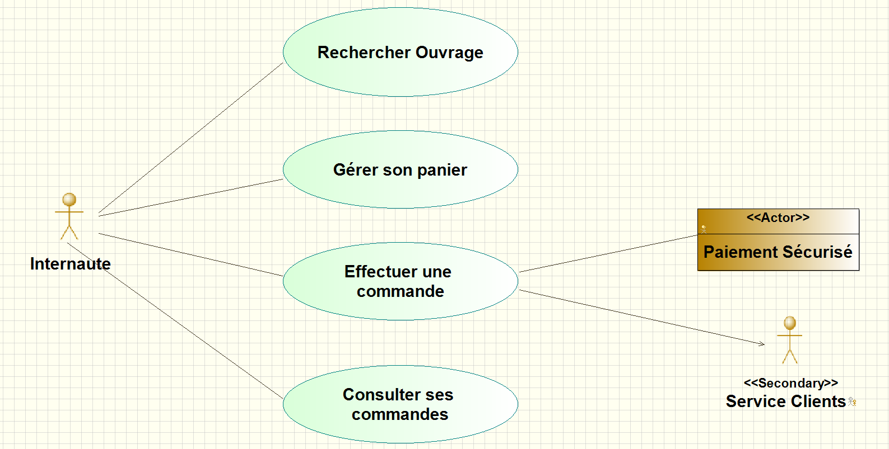

## Connaître les raccourcis autour du diagramme de cas d'utilisation  

Il existe des raccourcis pour créer plus facilement les diagrammes.

### `A` pour la création d'un *A*cteur

Tapez sur la touche **`A`**, puis cliquez sur votre diagramme de Use Cas à l'endroit où vous souhaitez créer un nouvel acteur.
Il ne vous reste plus qu'à renommer cet acteur (`F2`), en **`Libraire`** par exemple.

### `U` pour la création d'un *U*se Case (cas d'utilisation)

Tapez sur la touche **`U`**, puis cliquez sur votre diagramme de Use Cas à l'endroit où vous souhaitez créer un nouveau cas d'utilisation
Il ne vous reste plus qu'à renommer cet acteur (`F2`), en **`Maintenir le catalogue`** par exemple.

### `ESPACE` pour un lien de communication

Tapez sur la touche **`ESPACE`** pour activer la création d'un lien de communication.
Il ne vous reste plus qu'à cliquer sur (`Libraire`) (acteur à l'origine du lien) puis sur (`Maintenir le catalogue`) (use case destination du lien).

Le manuel utilisateur propose un tableau récapitulant les [raccourcis de création dans les diagrammes de cas d'utilisation](http://forge.modelio.org/projects/modelio3-localization-usermanual-french-340/wiki/Modeler-_modeler_shortcuts_usecase_diagram)

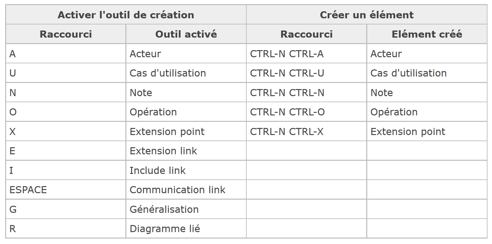

## Exercice : Compléter votre diagramme de cas d'utilisation ... 

Afin de mettre en pratique tout ce qui prècède, compléter votre diagramme de Use Case jusqu'à l'obtention du diagramme suivant :

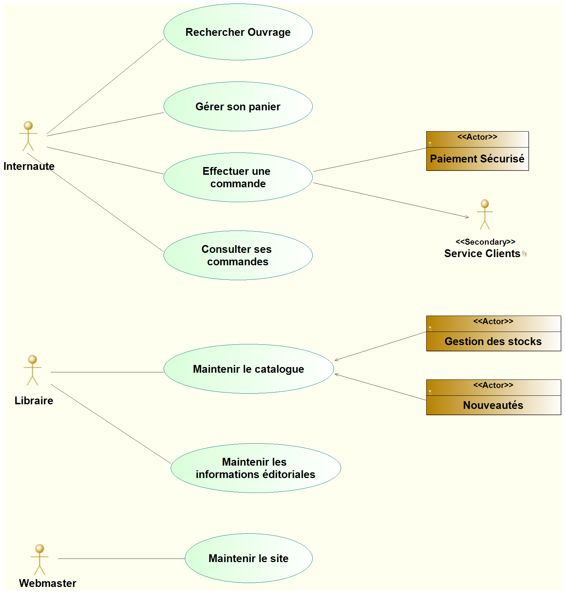

## Annoter un élément  

Pour ajouter un nouvel **acteur** sur votre **diagramme de Use Case**, commencez par ouvrir le groupe **Nodes** de la palette graphique de la **vue “Edition des diagrammes”**.

Pour que votre diagramme soit bien explicite, vous pouvez associer des notes aux éléments afin de détailler ou de justifier un choix de modélisation. 
  
Par exemple, que signifie exactemement pour vous *Maintenir les informations éditoriales* ?
Nous allons le préciser en ajoutant un commentaire dans une note associée au use case en question.

Commencez par ouvrir le groupe **Common** de la palette graphique de la **vue “Edition des diagrammes”** et cliquez sur **`Notes`**.

Cliquez sur l'élément auquel vous voulez ajouter une note, le use case **`Maintenir les informations éditoriales`** pour nous. Cet élément devient vert.

Cliquez alors sur le diagramme à l'emplacement auquel vous voulez positionner votre note.
Une note est alors créée relié à l'élément précdemment sélectionné.

En double-cliquant sur la note créée, la fenêtre **Edition** s'ouvre.  
Dans l'onglet **Note**, vous pouvez alors saisir la **description** que vous souhaitez ajouter, par exemple : **`Mise à jour des pages : Nouveautés et Meilleures ventes`**. Nous avons décoché l'option HTML puisque nous souhaitons un affichage le plus simple possible.    
Remarque : Vérifiez que le texte est bien mis à jour dans la note sur le graphique. Il faut parfois attendre quelques secondes pour que la mise à jour soit bien effective avant de refermer la fenêtre `Edition`.  

Redimensionnez votre note afin d'obtenir un affichage similaire à celui de la figure ci-dessous :

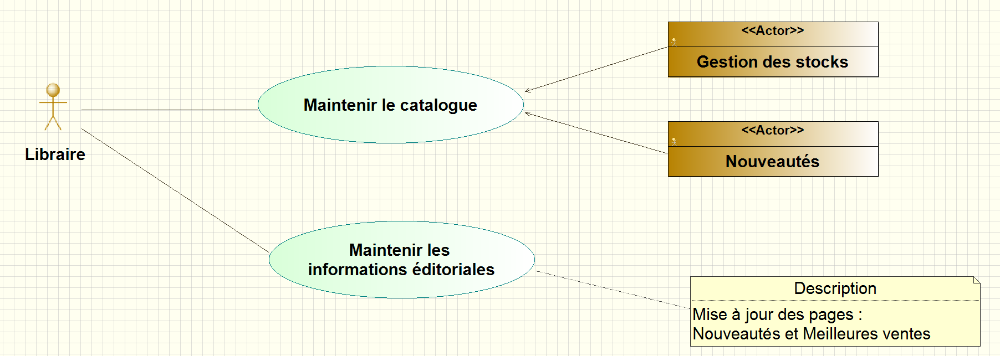

**Remarque:**

* Créer une note à partir de l'icone de la palette graphique est une solution rapide pour commenter les éléments. Le manuel utilisateur illustre dans la rubrique [Ajouter des notes / contraintes aux éléments](http://forge.modelio.org/projects/modelio3-localization-usermanual-french-340/wiki/Modeler-_modeler_building_models_add_notes), une autre solution qui consiste à utiliser la **vue *Notes et Contraintes***

* La **Note** permet d'associer des données textuelles à un élément. Il existe, sous Modélio, 4 mécanismes d'annotation utilisés pour compléter les propriétés des éléments :
    * **les stéréotypes** utilisés pour modifier / raffiner le type d'un objet 
    * **les tagged values** utilisées pour ajouter des propriétés à un élément 
    * **les notes & contraintes** utilisées pour la description, la documentation, le code,...
    * **les notes riches** similaire aux notes avec un contenu *plus riche* de type HTML, document OpenOffice ou Word, ...  
Pour en savoir plus, consulter la rubrique [Annoter des éléments](http://forge.modelio.org/projects/modelio3-localization-usermanual-french-340/wiki/Modeler-_modeler_building_models_annotating_elements) du manuel utilisateur.

----------

*Arrivé(e) à ce point du tutoriel, nous pouvons considérer que le diagramme de Use Case que vous venez de créer correspond au diagramme de use case obtenu lors d'une première itération.
Nous allons donc maintenant considérer que nous entrons dans une seconde itération qui consiste à affiner notre diagramme de Use Case*

----------

## Créer un acteur généralisé  

Nous allons modifier notre diagramme pour faire apparaître l'**acteur généralisé *abstrait* `Internaute`**.

Commencez par créer deux nouveaux acteurs sur le diagramme que vous appelerez **`Visiteur`** et **`Client`**.

L'acteur **`Internaute`** doit maintenant devenir la ***généralisation*** des rôles **Client** et **Visiteur**.  
Pour ajouter une **relation de généralisation** entre **`Client`** et **`Internaute`**, cliquez sur **Generalization** dans le groupe **Links** de la palette graphique.

L'origine du lien est l'acteur **`Client`** (que vous sélectionnerez par un clic).  
La destination du lien est l'acteur **`Internaute`** (que vous sélectionnerez par un clic). 

Le raccourci pour activer la création d'une relation de généralisation est la touche **`G`**.  
Appuyez sur la touche **`G`**, puis sélectionnez l'acteur **`Visiteur`** comme origine du lien.  
Sélectionnez ensuite l'acteur **`Internaute`** comme destination du lien.

L'acteur **`Internaute`** peut être vu comme une **généralisation abstraite** des rôles **Client** et **Visiteur**.  
Pour faire apparaître ce caractère ***abstrait*** sur le diagramme, nous pouvons modifier les propriétés de l'acteur afin que le rôle ***Internaute*** apparaisse déormais en italique.  
Sélectionner l'acteur **`Internaute`**, rendez-vous dans la **vue Symbol**.
Dans **Actor**, cliquez sur la valeur de la proriété **Font** afin de transformer le **Style de police** de **`Gras`** vers ***`Italique Gras`***.  
Le nom de l'acteur (rôle) apparait désormais en italique dans votre diagramme.

Après une remise en forme des éléments, vous devriez obtenir une figure semblable à la figure ci-dessous :

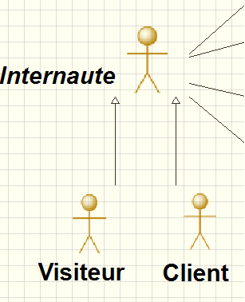

### Mise à jour du diagramme en tenant compte de l'acteur généralisé ...

D'après la modélisation faite en cours : 

* Un **`Internaute`**, qu'il soit **`Client`** ou **`Visiteur`** peut :
	* soit **`Rechercher un ouvrage`**
	* soit **`Gérer son panier`**
* Un **`Visiteur`** peut en plus :
	* **`Créer un compte Client`**
* Un **`Client`** peut en plus :
	* **`Effectuer une commande`**,
	* **`Consulter ses commandes`**
	* **`Gérer son compte client`**

Il faut donc mettre à jour le diagramme de use case en conséquence.  
Commencez par supprimer du diagramme de Use Case les liens reliant l'acteur **`Internaute`** aux uses cases : **`Effectuer une commande``** et **`Consulter ses commandes`**. 

#### Modification autour de l'acteur **`Client`**
  
C'est désormais le **`Client`** qui est l'acteur déclencheur de ses cas d'utilisation.
Ajoutez donc deux nouveaux **liens de communications** entre le **`Client`** et **`Effectuer une commande``** et **`Consulter ses commandes`**. 

Le **`Client`** doit également être relié à un troisième use case **`Gérer son compte client`** à créer.

#### Modification autour de l'acteur **`Visiteur`**

Créez ensuite un nouveau Use Case **`Créer un compte Client`** qui devra être relié à l'acteur **`Visiteur`**.

Votre de diagramme de Use Case autour des acteurs **`Internaute`**, **`Visiteur`** et **`Client`** doit désormais être conforme à la figure ci-dessous :

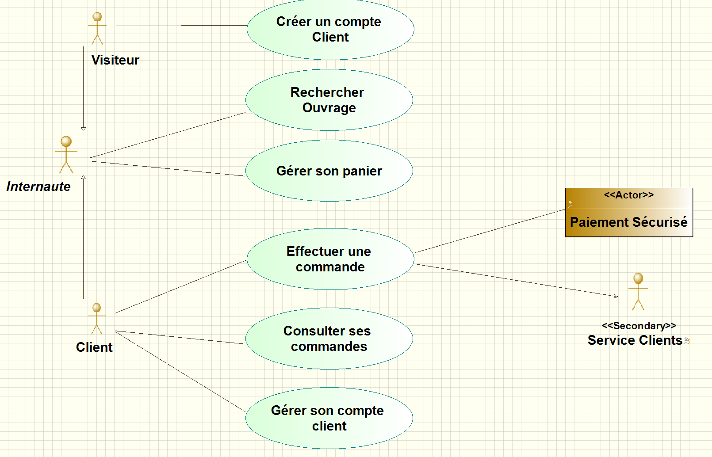

## Créer une relation d'inclusion entre deux cas d'utilisation  

Rappelons que dans le cas d'une **inclusion**, le cas d'utilisation source comprend le comportement décrit par le cas d’utilisation destination ***de manière obligatoire***.

Dans l'étude de cas **bookinons**, pour pouvoir **`Effectuer une commande`**, **`Consulter ses commandes`** ou **`Gérer son compte`**,  le **`Client`** doit obligatoirement **`S’authentifier`** au préalable . 

Commencez par créer sur votre diagrammme, un nouveau Use Case **`S’authentifier`**.

Pour créer une **relation d'inclusion** entre **`Effectuer une commande`** et **`S'authentifier`**, cliquez sur **`Inclusion relationship`** dans le groupe **Links** de la palette graphique.

L'origine du lien est le use case **`Effectuer une commande`** (que vous sélectionnerez par un clic).  
La destination du lien est le use case **`S'authentifier`** (que vous sélectionnerez par un clic).

Faites de même avec les use case **`Consulter ses commandes`** et **`Gérer son compte`** afin d'obtenir la modélisation ci-dessous. Pour information, le raccourci pour activer la création d'une relation d'inclusion est la touche **`I`**.  

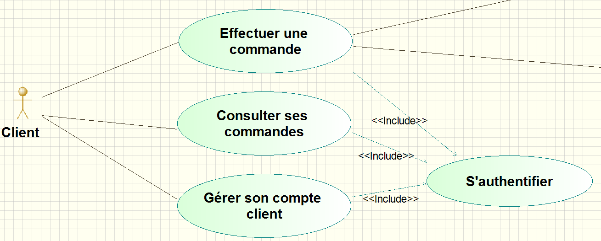

## Créer une relation d'extension entre deux cas d'utilisation  

Rappelons que dans le cas d'une **extension**, le cas d'utilisation source ajoute son comportement au cas d'utilisation destination ***de manière optionnelle***.

Dans l'étude de cas **bookinons**, **`Rechercher un ouvrage`** peut donner lieu à 
**`Effectuer une recherche détaillée`** c-a-d que la recherche détaillée peut être une option dans la recherche d'un ouvrage ...

Commencez par créer sur votre diagrammme, un nouveau Use Case **`Effectuer une recherche détaillée`**.

Pour créer une **relation d'extension** entre **`Effectuer une recherche détaillée`** et **`Rechercher un ouvrage`**, cliquez sur **`Extension relationship`** dans le groupe **Links** de la palette graphique.

L'origine du lien est le use case **`Effectuer une recherche détaillée`**. (que vous sélectionnerez par un clic).  
La destination du lien est le use case **`Rechercher un ouvrage`** (que vous sélectionnerez par un clic).

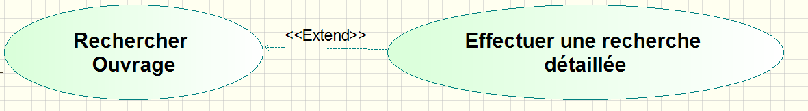

Pour information, le raccourci pour activer la création d'une relation d'inclusion est la touche **`E`**.  

## Exercice : Finaliser votre diagramme de cas d'utilisation ... 

Pour finaliser le diagramme de cas d'utilisation, nous souhaitons rajouter sur notre diagramme :

* un nouveau use case **`Consulter l'aide en ligne`** dont l'acteur est l'**`Internaute`**
* une note associée au use case **`Maintenir le site`**dont la description est **`Gestion des droits, Statistiques des ventes`** dont l'acteur est l'**`Internaute`**

**Remarque :** Pour **retailler automatiquement la taille d'un élément**, il est possible d'utiliser l'icône  (accessible dans la barre d'outils de la **vue d'Edition des diagrammes**, à côté des icônes correspondant aux différents choix d'alignement). Un clic sur cet icône permet d'ajuster la taille de l'élément sélectionné à son contenu. Cela est très pratique, essayez avec les descriptions par exemple ...

Après avoir effectué ces dernières modifications, assurez-vous qu'arrivé(e) à ce point du tutoriel votre diagramme de cas d'utilisation soit conforme à la figure ci-dessous.

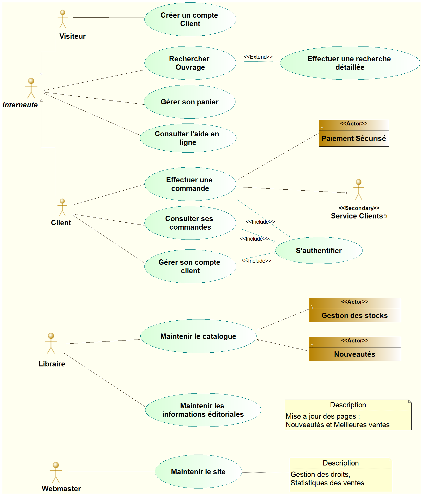

## Organiser les cas d'utilisation en *Package*  

UML propose le concept de **paquetage** (***package*** en anglais).  
Le package est un mécanisme général qui permet de regrouper des éléments UML

Il est ainsi possible de **regrouper les UC en package** en les classant ***par ensemble fonctionnel***.  
Par exemple, dans **bookinons** : 
 
* plusieurs UC concernent tout ce qui est relatif à l’**Internaute** (front-office)  
* plusieurs UC concernent et une partie propre aux **Employés** (back-office)  

Par ailleurs, il est également possible de créer un package pour les UC que nous qualifierons de ***UC de second rang*** ou de ***UC de seconde cible*** qui ne représentent pas une intention métier à part entière du client ( ***UC majeur*** ou ***UC de première cible*** ), mais plutôt un niveau intermédiaire comme pour l'UC **`S'authentifier`** 
qui permet au client d'exécuter ses propres UC majeurs.

Pour notre étude de case, nous choisissons de regrouper les UC selon leur ordre de priorité par rapport aux intentions métier des acteurs :  

* le package **`Cible 1`** contiendra 2 autres packages  :
	* **`UC des Internautes`** et  
	* **`UC des Employés`**  
* le package **`Cible 2`** contiendra directement les cas d’utilisations : **`Consulter l ’aide en ligne`** et **`S'authentifier`**.  

### Création de l'arborescence de packages
Pour mettre en place cette arborescence de packages, rendez-vous dans la **vue Model**, placez-vous sur **bookinons**, puis d'un clic droit sélectionnez (`Create element -> Package`).  
Une fois le package créé, renommez-le en **`Cible 1`**.

De la même manière à partir du package **`Cible 1`**, créez deux nouveaux packages : **`UC des Internautes`** et **`UC des Employés`**.  

Enfin, au même niveau que le package **`Cible 1`**, créez un nouveau package **`Cible 2`**.

Vous devriez obtenir une arobrescence similaire à la figure ci-dessous.
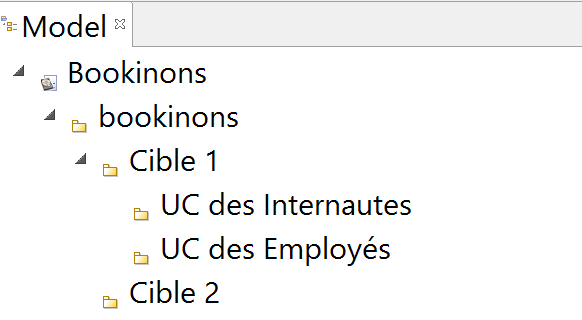

### Répartition des acteurs et cas d'utilisation dans les différents packages
Il ne vous reste plus qu'à déplacer les cas d'utilisation et les acteurs dans les packages concernés afin d'obtenir une répartition conforme à la figure ci-dessous.  
Peu importe pour le moment l'ordre des UC dans les packages.  
**Remarque :** Si vous souhaitez tout de même **classer les éléments** dans la **vue Model**, vous pouvez utiliser les flèches jaunes disponibles dans la barre d'outils de cette vue pour faire *monter* ou " *descendre* un élément à une position souhaitée.

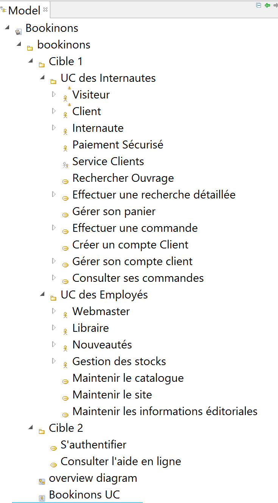

## Copier un diagramme en tant qu'image  

Comme l'indique la rubrique [Copier un diagramme en tant qu'image](http://forge.modelio.org/projects/modelio3-localization-usermanual-french-340/wiki/Modeler-_modeler_diagrams_copying), pour copier le contenu d’un diagramme au presse-papiers, il suffit de cliquer sur l’icône
 dans la barre d’outils du diagramme et puis de coller le contenu du diagramme dans un autre document.

**Remarque :** Seul le diagramme est copié, pas la grille.

## Recenser les éléments spécifiques aux diagramme d'activités 

#### D'après les spécifications officielles d'UML 

**Rappel:** Tous les éléments des diagrammes UML sont définis et illustrés dans le [Normative Documents](http://www.omg.org/spec/UML/2.5/PDF/).  
La dernière version est celle d'**UML 2.5**. Elle est disponible [ici](http://www.omg.org/spec/UML/2.5/)

Les chapitres **18.Usa Case** du [Normative Documents](http://www.omg.org/spec/UML/2.5/PDF/) traitent des différents éléments associés aux diagrammes d'activités.

#### Sous Modélio

Pour un diagramme d'activités, la palette graphique propose les éléments spécifiques suivants :

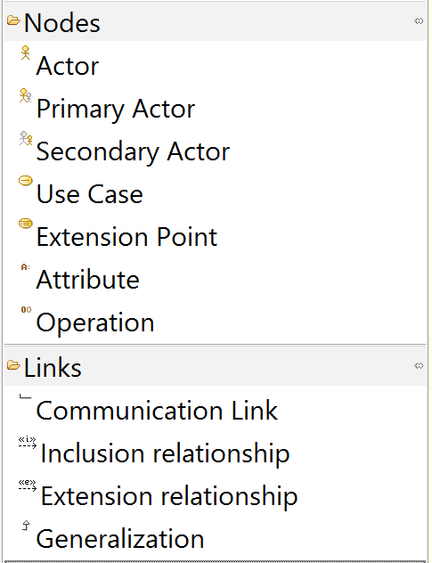

Ces éléments respectent la terminologie énoncée dans le [Normative Documents](http://www.omg.org/spec/UML/2.5/PDF/) (spécification d'UML). 

## Des exemples de diagrammes de cas d'utilisation réalisables avec Modelio 

La rubrique [ressources du site ModelioSoft](https://www.modeliosoft.com/en/resources/diagram-examples.html) propose des exemples de diagrammes réalisés avec Modélio.

Les exemples concernant les diagrammes de cas d'utilisation sont disponibles  : [ici](https://www.modeliosoft.com/en/resources/diagram-examples/use-case-diagrams.html)

## Quelques mots sur l'*approche vue 4+1* 

Ce tutoriel vous guide dans l'utilisation de [Modelio](https://www.modelio.org/) selon une démarche pseudo-RUP basé sur le modèle de Kruchten dit [modèle des 4 + 1 vues](https://fr.wikipedia.org/wiki/Architecture_logicielle#Le_mod.C3.A8le_des_4_.2B_1_vues), adopté dans l'[Unified Process](https://fr.wikipedia.org/wiki/Unified_process)

*** explication !!!

#### quelques mots sur l'aaproche 4+1

#### Arborescence pour l'approche 4+1

Créer la vue sécanrio ...
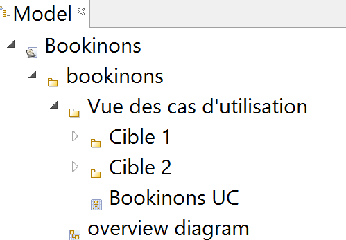

Enchainer avec l'approche 4+1 et demander de créer l'arboresceencte

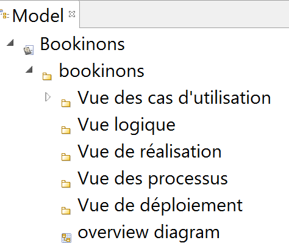
Bookinons_Approche_4_1

Ce tutoriel va vous guider dans l'utilisation de [Modelio](https://www.modelio.org/) selon une démarche pseudo-RUP basé sur le modèle de Kruchten dit [modèle des 4 + 1 vues](https://fr.wikipedia.org/wiki/Architecture_logicielle#Le_mod.C3.A8le_des_4_.2B_1_vues), adopté dans l'[Unified Process](https://fr.wikipedia.org/wiki/Unified_process)

Pour en savoir plus sur l'approche 4+1 : 
http://uml.free.fr/cours/i-p7.html
https://fr.wikipedia.org/wiki/Architecture_logicielle

***Remarque sur le choix de cette approche*** : L'*approche vues 4+1* permet de faire le lien entre la conception UML et la méthodologie (démarche) que nous allons adopter pour mener à bien notre projet. Cette démarche permettra de réaliser lors de différentes itérations, un enrichissement de l'étude basée sur UML : l'idée étant de partir des besoins utilisateurs et d'aller vers le code. Chaque étape permettra de mieux comprendre / modéliser le Système d'information.  
Il est intéressant de remarquer que les approches objets basées sur UML ont pour caractéristique et avantage de « proposer » sans « imposer ».   
Nous choisissons une **approche vue 4+1* pour organiser notre démarche et "classer nos diagrammes" mais les différents diagrammes UML pourraient tout aussi bien trouver leur place dans une autre approche.

**L’approche *4+1 View Model*** propose 5 vues :  
-	**Scenarios** : cette vue, appelée aussi vue des cas d'utilisation, guide toutes les autres vues car elle décrit les besoins attendus par chaque acteur du système. On dit souvent que
la vue scénario constitue  la "colle" qui unifie les 4 autres vues  
-	**Logical View** : cette vue décrit le comportement du système vu de l'intérieur. De haut niveau, cette vue se concentre sur l'abstraction et l'encapsulation : elle modélise les éléments et les mécanismes principaux du système.  
-	**Developpment View** : cette vue décrit l'organisation logicielle du projet. De bas niveau (aussi appelée vue de réalisation), cette vue identifie les modules qui réalisent (physiquement) les classes de la vue logique, elle montre également l'organisation entre les composants et leurs dépendances.   
-	**Physical View** : cette vue l'organisation matérielle du projet.Elle est très importante dans les environnements distribués.  
-	**Process View** : cette vue est intéressante dans les environnements multitâches car elle montre la décomposition du système en terme de processus.  

Remarque : Dans le cadre de ce tutoriel, nous nous contenterons uniquement du Diagramme Global.
Rappelons que nous appuyons notre démarche pseudo-RUP sur l’approche « vue 4+1 »  qui contient :
la vue scénario (Scenarios) ou  vue des cas d'utilisation ainsi que :
-	la vue logique (Logical View)
-	la vue implantation (Developpment View) ou vue de réalisation
-	la vue déploiement (Physical View) 
-	et la vue processus (Process View) 

Quelques mots de rappel sur la vue Scénario …
La vue Scénario (celle des cas d’utilisations) que nous venons d'enrichir avec le diagramme de use case est la vue de référence : toutes les autres vues dépendent de celle-ci. 
La vue scénario va permettre de partager les informations collectées (acteur et use case) avec les autres vues. En pratique, on rattache énormément de documentation à la vue scénario comme le cahier des charges ou la description détaillée des use case,…  La vue scénario est donc plutôt abstraite que technique.

…Avant de passer à la vue Logique …
Le passage à la vue Logique permet de mettre en route les premières réflexions concrètes sur le futur logiciel. En s'appuyant sur plusieurs diagrammes dynamiques, la vue logique propose une série de vues du système d'information d'un niveau d'abstraction très élevé.
La mise en place de la vue Logique se mène en permanence par rapport aux découvertes faites dans la vue Scénario. Les deux vues s'enrichissent mutuellement et il ne faut pas hésiter à passer de l'une à l'autre, à modifier l'une ET l'autre tout en avançant…

*******************
## ICI !!! => p.20 du tuto star UML
********************

Si vous décidez de suivre une approche vue 4+1 pour mener votre analyse (RUP ou pseudo-RUP), il est conseillé d'adopter l'arborescence suivante :

Dans ce cas-là, tout ce qui concerne les cas d'utilisation se retrouvera dans le vue Scénario.

***Mais gardez bien à l'esprit qu'UML est un LANGAGE...et pas une méthode d'analyse !!!***  

Modéliser via des diagrammes UML doit vous permettre avant tout d'expliciter et d'éclaircir certains points de votre développement.  
Cet arborescence est donc optionnelle pour simplement communiquer via UML.  
L'important est avant tout de savoir créer, comprendre et interpréter les différents diagrammes en utilisant le formalisme proposé par UML.

### Continuer la tutoriel par la prise en main des [diagrammes d'activités](Modelio_Activites.md) (Use Case)

## Quelques liens utiles 
[Raccourcis de création dans les diagrammes de cas d'utilisation](http://forge.modelio.org/projects/modelio3-localization-usermanual-french-340/wiki/Modeler-_modeler_shortcuts_usecase_diagram)

[Gérer les éléments dans un diagramme](http://forge.modelio.org/projects/modelio3-localization-usermanual-french-340/wiki/Modeler-_modeler_diagrams_handling_elements) 

## Zoom sur le manuel utilisateur...  

Vous trouvez dans cette partie les liens vers les parties du manuel utilisateur utiles pour la création des diagrammes de cas d'utilisation :

**Rubriques:**

 * **Créer un diagramme** disponible : [ici](http://forge.modelio.org/projects/modelio3-localization-usermanual-french-340/wiki/Modeler-_modeler_diagrams_creating_diagram) 
 *  **Créer un élément** disponible : [ici](https://forge.modelio.org/projects/modelio3-localization-usermanual-french-340/wiki/Modeler-_modeler_building_models_creating_elements)
 *  **Créer des éléments de type *noeud*** est disponible : [ici](https://forge.modelio.org/projects/modelio3-localization-usermanual-french-340/wiki/Modeler-_modeler_building_models_creating_elements_diagpalette). 
 *  **Créer des *liens* dans un diagramme** est disponible : [ici](https://forge.modelio.org/projects/modelio3-localization-usermanual-french-340/wiki/Modeler-_modeler_building_models_creating_links_diagrams). 
 *   **Créer des éléments dans un diagramme** est disponible : [ici](http://forge.modelio.org/projects/modelio3-localization-usermanual-french-340/wiki/Modeler-_modeler_diagrams_creating_elements)
 *   **Retailler un élément** est disponible : [ici](http://forge.modelio.org/projects/modelio3-localization-usermanual-french-340/wiki/Modeler-_modeler_interface_edition_view)
 *   **Ajouter des stéréotypes aux éléments** est disponible : [ici](http://forge.modelio.org/projects/modelio3-localization-usermanual-french-340/wiki/Modeler-_modeler_building_models_add_stereotypes)
 *   **Définir les options graphiques dans les diagrammes** est disponible : [ici](http://forge.modelio.org/projects/modelio3-localization-usermanual-french-340/wiki/Modeler-_modeler_diagrams_graphic_options)
 *   **Aligner des éléments** est disponible : [ici](https://forge.modelio.org/projects/modelio3-localization-usermanual-french-340/wiki/Modeler-_modeler_diagrams_aligning)
 *   **Gérer les éléments dans un diagramme** est disponible : [ici](https://forge.modelio.org/projects/modelio3-localization-usermanual-french-340/wiki/Modeler-_modeler_diagrams_handling_elements)

 *   **Raccourcis de création dans les diagrammes de cas d'utilisation** est disponible : [ici](http://forge.modelio.org/projects/modelio3-localization-usermanual-french-340/wiki/Modeler-_modeler_shortcuts_usecase_diagram)

*   **Copier un diagramme en tant qu'image** est disponible : [ici](http://forge.modelio.org/projects/modelio3-localization-usermanual-french-340/wiki/Modeler-_modeler_diagrams_copying)

**Vues:**

* **vue Modèle** disponible : [ici](http://forge.modelio.org/projects/modelio3-localization-usermanual-french-340/wiki/Modeler-_modeler_interface_uml_view)
* **vue Edition des diagrammes** disponible : [ici](http://forge.modelio.org/projects/modelio3-localization-usermanual-french-340/wiki/Modeler-_modeler_interface_edition_view)
* **vue Symbole** disponible : [ici](http://forge.modelio.org/projects/modelio3-localization-usermanual-french-340/wiki/Modeler-_modeler_diagrams_graphic_options)

**Exemples de diagrammes réalisés avec Modélio :** disponibles [ici](https://www.modeliosoft.com/en/resources/diagram-examples.html) 

