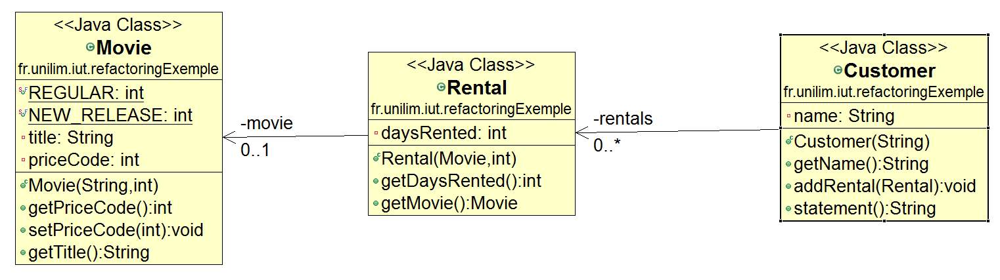

# Prise en main de [ObjectAid UMLExplorer](http://www.objectaid.com)

> [*The ObjectAid UML Explorer is an agile and lightweight code visualization tool for the Eclipse IDE.  
> It shows your Java source code and libraries in live UML class and sequence diagrams that automatically update as your code changes.*](http://www.objectaid.com/)  
 
Extrait du site [objectaid.com](http://www.objectaid.com/)

Dans ce tutoriel, nous verrons comment :

* [Installer ObjectAid UML Explorer](#installationObjectAid)
* [Réaliser un diagramme de classes sur un projet existant avec ObjectAid](#DiagClasses)
	* [Importer un projet existant](#importerProjet)
	* [Créer un diagramme de classes](#creerDiagClasses)
	* [Visualiser les classes Java sur le diagramme de classes](#visualiserDiagClasse)
	* [Sauvegarder une image du diagramme de classes](#saveImage)
	* [Où trouver plus de documentation](#documentation)

Nous évoquerons comment :   
  
* [Réaliser un diagramme de séquences avec ObjectAid](#DiagSequences) (fonctionnalité soumise à licence, mais une version d'évaluation existe)

Nous terminerons par :

* [Quelques liens](#liens)

## Installer ObjectAid UML Explorer 

Deux installations sont possibles :  
- soit à partir d'Eclipse via le menu `Install New Software...`  
- soit à partir de l'[Eclipse market place](https://marketplace.eclipse.org)

#### Depuis le menu `Install New Software...` sous Eclipse

L'installation de [ObjectAid UMLExplorer](http://www.objectaid.com) depuis le menu (`Help ->Install New Software ...`) est décrite et illustrée à l'adresse suivante : [http://www.objectaid.com/installation](http://www.objectaid.com/installation)

#### Depuis l'Eclipse marketPlace en ligne 

[ObjectAid UMLExplorer](http://www.objectaid.com) est disponible sur le site de l'Eclipse MarketPlace à l'adresse suivante : [http://marketplace.eclipse.org/content/objectaid-uml-explorer](http://marketplace.eclipse.org/content/objectaid-uml-explorer)

Rendez-vous sur cette page, puis faites un *drag an drop* du bouton **Install** vers votre IDE. Une boîte de dialogue `Eclipse MarketPlace` s'ouvre.
Vérifiez que tout est coché et cliquez sur `Confirm`. Acceptez la licence afin de dévérouiller le bouton `Finish`.

Dans les deux cas, vous devez relancer Eclipse pour que [ObjectAid UMLExplorer](http://www.objectaid.com) soit désormais pris en compte dans Eclipse.

## Réaliser un diagramme de classes sur un projet existant avec ObjectAid 

### Importer un projet existant 

A partir de (`File -> Import ... -> Existing Projects into Workspace`), cochez  `Select archive file` puis passez en paramètre le fichier **`refactoringExemple.zip`** disponible juste au-dessus.

Vous obtenez 3 classes : **`Customer.java`**, **`Movie.java`** et **`Rental.java`**.

Placez-vous alors sur ce projet (**`refactoringExemple`**) dans le **Package Explorer** et faites  un (`Maven -> Update Project ...`).

### Créer un diagramme de classes 

A partir de (`File -> New -> Other...`) (que l'on peut atteindre directement avec le raccourci clavier `Ctrl+N`), sélectionnez (**`ObjectAid UML Diagram->Class Diagram`**).

Entrez le nom du fichier que vous souhaitez donner à ce diagramme de classe, par exemple `model`.  
Un fichier `model.ucls` est alors créé.

### Visualiser les classes Java sur le diagramme de classes 

Ouvrez le diagramme de classes en doube-cliquant sur le fichier `model.ucls`.  
Faites glisser les classes que vous souhaitez visualiser sur votre diagramme de classes depuis le **Package Explorer** vers le fichier **`model.ucs`** (diagramme de classes).

Vous devriez obtenir un diagramme de classes similaires au suivant :

Dorénavant, lorsque le code java est modifié, le diagramme de classes l'est aussi !

#### Modifications depuis le code 

Dans le code de la classe  **`Customer`**, ajoutez le nouvel attribut suivant : **`private String nouvelAttribut;`** et sauvegardez.  
Rendez-vous ensuite dans le diagramme de classes pour constater que la classe **`Customer`** dispose bien de l'attribut **`nouvelAttribut`** : le modèle s'étant bien synchronisé avec le code lors de la sauvegarde du fichier.

Dans le code de la classe  **`Customer`**, supprimez l'attribut **`nouvelAttribut`** (que vous venez de créer) et sauvegardez.  
Rendez-vous dans le diagramme de classes pour constater que **`nouvelAttribut`** a bien disparu de la liste des attributs de la classe **`Customer`**...

#### Pas de modifications directement depuis le modèle

On ne peut pas faire des modifications directement depuis le diagramme de classes.  
Le modèle renvoie sur le code correspondant.

Par exemple, rendez-vous sur la classe  **`Customer`** du diagramme de classes, et double-cliquez.  Vous vous retrouvez alors dans le code Java de cette même classe.

### Sauvegarder une image du diagramme de classes 

Une image du diagramme de classes peut être sauvegardé à tout moment grâce au menu `Save As Image ...` obtenu par un simple clic droit sur le fichier.

### Où trouver plus de documentation 
La documentation concernant le diagramme de classe est disponible sur [www.objectaid.com/class-diagram](http://www.objectaid.com/class-diagram) avec un complément dans la section [Diagram Add-On](http://www.objectaid.com/diagram-add-on), mais les add-ons sont quant à eux soumis à licence...

## Réaliser un diagramme de séquences avec ObjectAid  

Réaliser des diagrammes de séquences avec ObjectAid n'est possible qu'après une installation de licence. Le protocole est expliqué [ici](http://www.objectaid.com/install-license). Il est toutefois possible de tester cette fonctionnalité pendans un mois, puisque lorsque vous [créez un compte](https://www.objectaid.com/login), deux licences d'évaluation gratuites vous sont proposées.

La réalisation du diagramme de séquences est alors similaire à la réalisation du diagramme de classes.

Il faut d'abord **créer le diagramme de séquences** à partir de (**`File -> New -> Other...-> ObjectAid UML Diagram -> Sequence Diagram`**).  

Un fichier est alors créé avec l'extension **`.useq`**.  
La réalisation du diagramme de séquences se fera par des **glisser-déposer** de classes et de méthodes depuis le **Package Explorer** vers le fichier **`.useq`**.

Vous trouverez un exemple dans la documentation disponible sur [www.objectaid.com/sequence-diagram](http://www.objectaid.com/sequence-diagram).

## Quelques liens 
[http://www.objectaid.com](http://www.objectaid.com)  
[https://marketplace.eclipse.org/content/objectaid-uml-explorer](https://marketplace.eclipse.org/content/objectaid-uml-explorer)